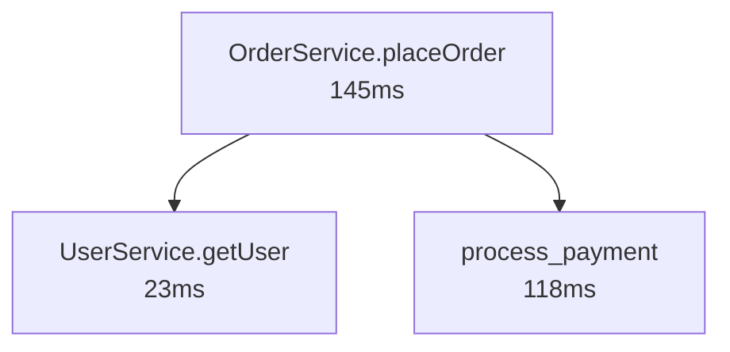

# Ghost Doc — Technical Documentation

> Black-box documentation library that observes real code execution and generates visual and text documentation automatically, without requiring manual comments or annotations.

---

## Table of Contents

1. [Concept Overview](#1-concept-overview)
2. [System Architecture](#2-system-architecture)
3. [Data Flow](#3-data-flow)
4. [The Trace Schema](#4-the-trace-schema)
5. [Module: Agent JS](#5-module-agent-js)
6. [Module: Agent Python](#6-module-agent-python)
7. [Module: Hub](#7-module-hub)
8. [Module: Dashboard](#8-module-dashboard)
9. [Module: Exporter](#9-module-exporter)
10. [Monorepo Structure](#10-monorepo-structure)
11. [CLI Reference](#11-cli-reference)
12. [Configuration](#12-configuration)
13. [Security Model](#13-security-model)

---

## 1. Concept Overview

Ghost Doc instruments your code at runtime. Instead of requiring developers to write documentation, it observes how functions are actually called — their inputs, outputs, call order, timing, and errors — and turns that live behavior into a visual call graph and permanent written documentation.

**The core insight:** the most accurate documentation of a function is how it actually behaves in production, not what a developer thought it would do when they wrote a comment two years ago.

### What Ghost Doc is NOT

- Not a static analysis tool (it does not read your code to infer types or relationships)
- Not a profiler (it does not sample the call stack; only traced functions emit spans)
- Not a logging framework (it captures structured semantic events, not free-form text)
- Not APM (it is local-first, developer-focused, and produces human-readable documentation)

---

## 2. System Architecture

Ghost Doc is composed of four independent modules that communicate over WebSocket and HTTP:

```
┌─────────────────────────────────────────────────────────────────┐
│  Your Application                                               │
│                                                                 │
│   ┌─────────────┐          ┌──────────────────┐                │
│   │  Agent JS   │          │  Agent Python    │                │
│   │  @trace     │          │  @tracer.trace   │                │
│   │  decorator  │          │  decorator       │                │
│   └──────┬──────┘          └────────┬─────────┘                │
│          │  TraceEvent (JSON/WS)    │                           │
└──────────┼─────────────────────────┼───────────────────────────┘
           │                         │
           ▼                         ▼
    ┌──────────────────────────────────────┐
    │             Hub (Node.js)            │
    │  ws://localhost:3001/agent           │
    │                                      │
    │  • Validates incoming spans (Zod)    │
    │  • Correlates spans into call trees  │
    │  • Detects anomalies                 │
    │  • Buffers last 10,000 spans         │
    │  • Fans out to Dashboard clients     │
    │  • Serves REST API                   │
    └──────────────────┬───────────────────┘
                       │
         ┌─────────────┴─────────────┐
         │                           │
         ▼                           ▼
  ┌─────────────┐          ┌──────────────────┐
  │  Dashboard  │          │    Exporter      │
  │  (React)    │          │                  │
  │  Real-time  │          │  Markdown        │
  │  flowchart  │          │  Mermaid         │
  │  inspector  │          │  Notion/Obsidian │
  │  time-travel│          │  Snapshots       │
  └─────────────┘          └──────────────────┘
```

### Module Responsibilities

| Module | Role | Transport |
| :--- | :--- | :--- |
| **Agent JS** | Decorates JS/TS functions; emits `TraceEvent` spans | WebSocket client → Hub |
| **Agent Python** | Decorates Python functions; emits `TraceEvent` spans | WebSocket client → Hub |
| **Hub** | Aggregates, validates, correlates, and streams spans | WebSocket server + HTTP REST |
| **Dashboard** | Real-time visual UI; flowchart, inspector, time-travel | WebSocket client ← Hub |
| **Exporter** | Converts trace data to permanent documentation | Reads Hub REST API |

---

## 3. Data Flow

### Single-Agent Flow

```
1. Developer adds @trace to a function
2. Function is called at runtime
3. Agent captures: file, line, function name, args, return value, timing
4. Agent sanitizes captured data (removes sensitive keys)
5. Agent serializes data as a TraceEvent JSON payload
6. Agent sends payload to Hub via WebSocket
7. Hub validates the payload against the Zod schema
8. Hub stores the span in its in-memory ring buffer
9. Hub broadcasts the span to all connected Dashboard clients
10. Dashboard appends the span to its store
11. Dashboard re-renders the flowchart with the new node/edge
```

### Distributed (Cross-Agent) Flow

When a JS backend calls a Python service, they can share the same `trace_id`:

```
1. JS Agent starts a span — generates trace_id = "abc-123", span_id = "span-1"
2. JS function makes HTTP call to Python service
3. JS Agent attaches X-Trace-Id: abc-123 header to the HTTP request
4. Python service receives the request
5. Python Agent reads trace_id from context (passed via header or ContextVar)
6. Python Agent creates a child span: trace_id = "abc-123", parent_span_id = "span-1"
7. Both spans arrive at Hub
8. Hub correlates them via trace_id → single distributed call tree
9. Dashboard shows a cross-agent call edge (color-coded by agent)
```

### Offline Buffering Flow

When the Hub is unreachable:

```
1. Agent tries to connect to Hub WebSocket → fails
2. Agent activates exponential backoff reconnect (1s, 2s, 4s, ..., 30s cap)
3. During disconnect, every emitted span is pushed into a RingBuffer (max 500)
4. When buffer is full, oldest spans are evicted to make room for new ones
5. When connection is restored, agent drains the entire buffer and sends all buffered spans
6. Normal operation resumes
```

---

## 4. The Trace Schema

Every span emitted by any agent — in any language — must conform to this schema. The schema is defined as a Zod schema in `packages/shared-types` and also exported as a JSON Schema for cross-language validation.

```typescript
{
  // Protocol version — allows Hub to handle old agents gracefully
  schema_version: "1.0",

  // Trace identity
  trace_id: string,        // UUID v4 — same across all spans in a single call chain
  span_id: string,         // UUID v4 — unique per function invocation
  parent_span_id: string | null,  // null if this is the root span

  // Source location
  source: {
    agent_id: string,      // developer-configured, e.g. "frontend", "payments-service"
    language: "js" | "python" | "go" | "rust" | "java" | "ruby" | "other",
    file: string,          // relative file path
    line: number,          // line number where the function is defined
    function_name: string, // qualified name, e.g. "UserService.createUser"
  },

  // Timing
  timing: {
    started_at: number,    // Unix timestamp in milliseconds
    duration_ms: number,   // wall-clock duration from call to return
  },

  // Captured data (sanitized)
  input: unknown[],        // array of arguments passed to the function
  output: unknown,         // return value (null if function threw)
  error: {
    type: string,          // exception class name, e.g. "TypeError"
    message: string,       // exception message
    stack: string,         // stack trace as a string
  } | null,

  // Extensible metadata
  tags: Record<string, string>,  // arbitrary key-value pairs for filtering
}
```

### Schema Rules

- `trace_id` and `span_id` must be valid UUID v4 strings.
- If `error` is non-null, `output` must be null.
- `parent_span_id` is null only for the root span of a trace. All other spans must reference a valid `span_id` within the same trace.
- `input` is always an array (even for zero-argument functions, it is an empty array `[]`).
- `tags` values are always strings. Numbers and booleans must be coerced before being added as tags.

---

## 5. Module: Agent JS

**Package:** `packages/agent-js`
**npm name:** `@ghost-doc/agent-js`
**Status:** Implemented (Phase 1)

### Installation

```bash
npm install @ghost-doc/agent-js
# or
pnpm add @ghost-doc/agent-js
```

### Quick Start

```typescript
import { createTracer } from "@ghost-doc/agent-js";

export const tracer = createTracer({
  agentId: "my-service",
  hubUrl: "ws://localhost:3001/agent",
});
```

### `createTracer(config)` — Factory

Creates and returns a configured `TracerInstance`. Starts the WebSocket connection to the Hub immediately.

#### Config options

| Option | Type | Default | Description |
| :--- | :--- | :--- | :--- |
| `agentId` | `string` | **required** | Identifies this agent in the Hub and Dashboard |
| `hubUrl` | `string` | `"ws://localhost:3001/agent"` | WebSocket URL of the Hub's agent endpoint |
| `enabled` | `boolean` | `true` | Set to `false` to disable all tracing (e.g. in tests) |
| `sanitize` | `string[] \| SanitizerFn` | Default keys list | Keys to redact from `input` and `output` before emitting |
| `bufferSize` | `number` | `500` | Maximum spans held in the offline ring buffer |

#### Default sanitized keys

The following keys are redacted by default (case-insensitive, applied recursively):

```
password, passwd, secret, token, api_key, apikey, authorization,
auth, credential, credentials, private_key, access_key, session
```

### `@trace` Decorator

Instruments a class method. Captures all calls automatically.

```typescript
import { tracer } from "./tracer.js";

class UserService {
  @tracer.trace
  async createUser(name: string, email: string) {
    // ...
    return { id: "u-123", name, email };
  }

  @tracer.trace({ label: "fetch-user-by-email" })
  async findByEmail(email: string) {
    // ...
  }
}
```

#### What is captured per call

| Field | Source |
| :--- | :--- |
| `function_name` | Class name + method name (e.g. `"UserService.createUser"`) or custom `label` |
| `file` | Parsed from `Error.stack` at decoration time |
| `line` | Parsed from `Error.stack` at decoration time |
| `input` | Sanitized copy of `arguments` array |
| `output` | Sanitized return value (awaited if async) |
| `error` | Caught exception (type, message, stack); exception is re-thrown after capture |
| `timing.started_at` | `Date.now()` at call entry |
| `timing.duration_ms` | `performance.now()` delta from entry to return/throw |
| `trace_id` | Inherited from parent span context (AsyncLocalStorage) or new UUID v4 |
| `span_id` | New UUID v4 per call |
| `parent_span_id` | Current span from AsyncLocalStorage, or null |

### `tracer.wrap(fn, label?)` — Plain Function Wrapper

For arrow functions and functions that cannot use decorators:

```typescript
const processPayment = tracer.wrap(async (amount: number, currency: string) => {
  // ...
  return { success: true };
}, "process-payment");
```

Identical capture behavior to the `@trace` decorator.

### Context Propagation

Ghost Doc uses Node.js `AsyncLocalStorage` to automatically propagate trace context across async call chains without any manual threading of IDs.

```typescript
class OrderService {
  @tracer.trace
  async placeOrder(cart: Cart) {
    // trace_id is created here (root span)
    const user = await this.userService.getUser(cart.userId); // child span inherits trace_id
    const payment = await this.paymentService.charge(cart.total); // another child span
    return { orderId: "o-1", user, payment };
  }
}
```

All three spans share the same `trace_id`. The `getUser` and `charge` spans have `parent_span_id` pointing to `placeOrder`'s `span_id`.

### Transport and Reconnection

The agent connects via the `ws` library. On disconnect, it retries with exponential backoff:

```
Attempt 1: wait 1s
Attempt 2: wait 2s
Attempt 3: wait 4s
...
Attempt 10+: wait 30s (capped), logs a warning
```

During disconnect, all spans are stored in the in-memory `RingBuffer`. When the connection is restored, the buffer is drained and all buffered spans are sent in order.

### Sanitization

Deep recursive sanitization applied before any span is emitted:

```typescript
const tracer = createTracer({
  agentId: "api",
  // String array: keys to redact (case-insensitive)
  sanitize: ["password", "token", "secret"],
});

// OR: custom function
const tracer = createTracer({
  agentId: "api",
  sanitize: (key, value) => {
    if (key === "creditCard") return "[PAYMENT-REDACTED]";
    return value; // keep as-is
  },
});
```

The sanitizer walks the full object tree recursively. Circular references are detected via `WeakSet` and replaced with `"[Circular]"`.

---

## 6. Module: Agent Python

**Package:** `packages/agent-python`
**PyPI name:** `ghost-doc-agent`
**Status:** Implemented (Phase 1)

### Installation

```bash
pip install ghost-doc-agent
```

### Quick Start

```python
from ghost_doc_agent import Tracer

tracer = Tracer(
    agent_id="my-python-service",
    hub_url="ws://localhost:3001/agent",
)
```

### `Tracer(agent_id, hub_url, ...)` — Class

Creates and configures the Python tracer. Starts a background daemon thread that owns a dedicated `asyncio` event loop for WebSocket communication. This design keeps the main application thread free — tracing is always non-blocking.

#### Constructor parameters

| Parameter | Type | Default | Description |
| :--- | :--- | :--- | :--- |
| `agent_id` | `str` | **required** | Identifies this agent in the Hub and Dashboard |
| `hub_url` | `str` | `"ws://localhost:3001/agent"` | WebSocket URL of the Hub's agent endpoint |
| `enabled` | `bool` | `True` | Set to `False` to disable all tracing |
| `sanitize` | `list[str]` | Default keys list | Keys to redact from `input` and `output` |
| `buffer_size` | `int` | `500` | Maximum spans held in the offline ring buffer |

### `@tracer.trace` Decorator

Works on both synchronous and asynchronous functions:

```python
from myapp.tracer import tracer

class UserService:
    @tracer.trace
    def create_user(self, name: str, email: str) -> dict:
        """Creates a new user record in the database."""
        return {"id": "u-123", "name": name, "email": email}

    @tracer.trace
    async def find_by_email(self, email: str) -> dict | None:
        """Looks up a user by email address."""
        ...

    @tracer.trace(label="custom-label", description="Explicit override")
    def some_method(self):
        ...
```

The decorator detects whether the wrapped function is a coroutine (`asyncio.iscoroutinefunction`) and returns the appropriate wrapper type, so it is safe to use on both `def` and `async def` functions in the same codebase.

#### Docstring auto-extraction

When no `description` argument is passed, the agent automatically extracts the **first line of the function's docstring** (via `inspect.cleandoc`) and sets it as the span's `source.description`. This description appears in the dashboard node tooltip and inspector panel. Pass `description=` explicitly to override it.

### Context Propagation

Python uses `contextvars.ContextVar` for trace context propagation. The context is automatically propagated across:

- Regular synchronous call chains
- `asyncio` coroutine chains
- `asyncio.create_task()` (tasks inherit the context of their creator)

```python
@tracer.trace
async def handle_request(request):
    # trace_id is created here
    user = await get_user(request.user_id)     # child span
    result = await process_data(user)           # child span
    return result

@tracer.trace
async def get_user(user_id: str) -> dict:
    # parent_span_id = handle_request's span_id
    # trace_id = same as handle_request's trace_id
    ...
```

### Transport

The Python transport uses the `websockets` library. A background daemon thread runs its own `asyncio` event loop. Calls to `transport.send(event)` are thread-safe: they use `asyncio.run_coroutine_threadsafe()` to schedule the send on the background loop from any thread.

The reconnect loop inside the background loop retries with exponential backoff identical to the JS agent (1s → 30s cap).

---

## 7. Module: Hub

**Package:** `packages/hub`
**npm name:** `ghost-doc`
**Status:** Implemented (Phase 2)

The Hub is the central broker. All agents connect to it; all Dashboard clients receive from it. It is a Node.js process that ships as a CLI: `npx ghost-doc start`.

The Hub also serves the pre-built Dashboard as static files on the same port. After running `pnpm demo:build` (which copies `packages/dashboard/dist` to `packages/hub/public`), opening `http://localhost:3001` in a browser renders the full dashboard UI. No separate dev server is needed in production.

### WebSocket Endpoints

#### `ws://localhost:3001/agent`

Agents connect here to stream spans. The Hub:

1. Accepts the connection.
2. For every message: validates the JSON payload against `TraceEventSchema` (Zod).
3. If validation passes: stores the span, runs correlation, fans out to Dashboard clients.
4. If validation fails: logs the error with the raw payload and discards the message — the Hub never crashes on bad input.

#### `ws://localhost:3001/dashboard`

Dashboard clients connect here to receive the live stream. The Hub sends every validated span to all connected Dashboard clients immediately after storing it.

### HTTP REST API

#### `GET /health`

Returns the current Hub status.

```json
{
  "status": "ok",
  "agents": 2,
  "traces_total": 1847,
  "uptime_ms": 43200000
}
```

#### `GET /traces`

Returns the last N spans from the in-memory buffer.

Query parameters:

| Parameter | Type | Default | Description |
| :--- | :--- | :--- | :--- |
| `limit` | `number` | `100` | Maximum number of spans to return |
| `agent_id` | `string` | — | Filter by agent ID |
| `function_name` | `string` | — | Filter by function name (substring match) |
| `trace_id` | `string` | — | Filter by trace ID |

#### `GET /traces/:trace_id`

Returns the full call tree for a distributed trace. The response is a nested tree structure:

```json
{
  "trace_id": "abc-123",
  "agents": ["frontend", "payments-service"],
  "root": {
    "span_id": "span-1",
    "function_name": "OrderService.placeOrder",
    "timing": { "started_at": 1700000000000, "duration_ms": 145.2 },
    "children": [
      {
        "span_id": "span-2",
        "function_name": "UserService.getUser",
        "children": []
      },
      {
        "span_id": "span-3",
        "function_name": "process_payment",
        "source": { "language": "python", "agent_id": "payments-service" },
        "children": []
      }
    ]
  }
}
```

#### `POST /snapshot`

Saves the current trace buffer to `~/.ghost-doc/snapshots/<timestamp>.json`. Returns the snapshot ID.

#### `GET /snapshots`

Lists all saved snapshots with metadata (timestamp, agent list, span count).

#### `GET /snapshots/:id`

Returns the full content of a saved snapshot.

### Trace Correlation Engine

The correlation engine runs on every incoming span. It maintains a map of `trace_id → SpanTree`.

1. **Tree building:** Each span is inserted into the tree at the position defined by its `parent_span_id`. The root span (null parent) becomes the tree root.
2. **Cross-agent detection:** If a trace contains spans from more than one `agent_id`, the trace is marked as distributed. The Dashboard renders cross-agent edges with a distinct color.
3. **Anomaly detection:** For every `function_name`, the Hub tracks the TypeScript/Python type of the return value across all calls. If a call returns a type different from the historical baseline (e.g., returns `null` when it has always returned an object), the span is annotated with `anomaly: true`. This annotation is included in the fan-out to the Dashboard.

### In-Memory Store

- Circular ring buffer: holds the last **10,000 spans**.
- Indexed by `trace_id`, `span_id`, `agent_id`, and `function_name` for fast filtered queries.
- Optional flush to disk at `~/.ghost-doc/traces/` (configurable via `~/.ghost-doc/config.json`).
- When the buffer is full, the oldest spans are evicted (same behavior as Agent ring buffers).

### CLI Commands

See [CLI Reference](#11-cli-reference) for full details.

---

## 8. Module: Dashboard

**Package:** `packages/dashboard`
**Status:** Implemented (Phase 3)

The Dashboard is a Vite + React + TypeScript single-page application. It connects to the Hub via WebSocket and renders a live call graph.

**Deployment:** The Hub serves the compiled dashboard as static files (via `@fastify/static`) from `packages/hub/public`. Build the dashboard and copy its output with `pnpm demo:build`, then access it at `http://localhost:3001`. For development with hot-reload, run `pnpm --filter @ghost-doc/dashboard dev` alongside the Hub.

**WebSocket URL resolution:** In dev mode (`import.meta.env.DEV`), the dashboard connects to `ws://localhost:3001/dashboard`. In production (served by the Hub), it derives the WebSocket URL from `window.location` so it works regardless of host or port — no hardcoded URLs.

### Tech Stack

| Layer | Technology |
| :--- | :--- |
| Build | Vite |
| UI framework | React 18 |
| State management | Zustand |
| Graph rendering | D3.js (force-directed layout) |
| Styling | Tailwind CSS |
| Testing | Vitest + React Testing Library + Playwright |

### Real-Time Flowchart

The main view is a D3 force-directed graph where:

- **Nodes** represent unique functions (identified by `agent_id + function_name`).
- **Edges** represent call relationships (parent span → child span).

Node visual states:

| State | Visual |
| :--- | :--- |
| Normal | Neutral fill, agent color accent |
| Error | Red fill + error icon |
| Anomaly | Red border + pulsing ring |
| Slow (> P95) | Orange border |

The graph updates incrementally — new nodes and edges animate in without re-rendering the entire graph. D3 zoom and pan are enabled.

### Node Tooltip

Hovering over any node shows a tooltip with:

- Function name (monospace)
- **Description** — the text provided via `@trace("label", "description")` or `tracer.trace(description=...)`. For Python functions, the first line of the docstring is used automatically when no explicit description is given.
- Source file path
- Call count, average duration, P95 duration

### Inspector Panel

Clicking any node in the flowchart opens the Inspector panel on the right side:

- Function name and agent badge
- **Description** (if provided or auto-extracted from docstring)
- Source file and line number
- Total call count, average duration, P95 duration, duration sparkline
- All recorded calls for this function, sorted newest-first
- Per-call detail: input args (formatted JSON), output (formatted JSON), duration, timestamp
- Error detail with full stack trace
- "Copy trace JSON" button
- "Copy as curl" (for HTTP handlers that Ghost Doc identifies)

### Time-Travel Debugger

A timeline scrubber at the bottom of the screen allows replaying the call graph as it appeared at any point in time:

- Timeline is divided into 1-second ticks.
- Dragging the scrubber replays the graph state at that timestamp.
- "Live" button snaps back to real-time.
- Playback speeds: 0.5×, 1×, 2×, 10×.
- Red ticks on the timeline mark timestamps where anomalies occurred.

### Header Controls

- Connected agents list with online/offline status indicators.
- Trace rate counter (spans/sec, updated every second).
- Search and filter by agent, function name, or tag.
- Clear button (wipes the Zustand store; does not affect Hub).
- Export button (triggers the Exporter).

---

## 9. Module: Exporter

**Package:** `packages/exporter`
**Status:** Planned (Phase 4)

The Exporter converts live trace data into permanent, shareable documentation in various formats.

### Markdown + Mermaid

Generates a Markdown file with an embedded Mermaid flowchart:

```bash
npx ghost-doc export --format markdown --output docs/FLOW.md
```

Output structure:

```markdown
# Ghost Doc — Execution Flow

Generated: 2025-01-15T10:30:00Z
Agents: frontend, payments-service



## Function Index

| Function | File | Avg Duration | Calls |
| :--- | :--- | :--- | :--- |
| OrderService.placeOrder | src/orders/service.ts:45 | 145ms | 892 |
| ...

## Anomalies

- `process_payment` (payments-service): return type changed at 2025-01-15T09:12:00Z
```

The Mermaid block renders natively on GitHub, GitLab, and most documentation sites.

### Snapshot Share

```bash
# Save current trace buffer as a snapshot
npx ghost-doc snapshot
# → Saved: ~/.ghost-doc/snapshots/2025-01-15T10-30-00.json (ID: abc123)

# Share the snapshot as a self-contained URL fragment
npx ghost-doc share abc123
# → ghost-doc://load#<base64-encoded-snapshot>

# Restore a snapshot into the Dashboard
npx ghost-doc load <encoded>
```

Snapshots include the full trace tree, agent metadata, and timestamps. They can be stored in version control alongside the code they document.

### Wiki-Sync: Notion

```bash
npx ghost-doc export \
  --format notion \
  --token <NOTION_INTEGRATION_TOKEN> \
  --page-id <NOTION_PAGE_ID>
```

Creates or updates a Notion page with the Mermaid flowchart and function table. Running the command again updates the existing page (idempotent).

### Wiki-Sync: Obsidian

```bash
npx ghost-doc export \
  --format obsidian \
  --vault-path ~/Notes
```

Writes `Ghost-Doc/<project-name>.md` inside the Obsidian vault.

### Wiki-Sync: Confluence

```bash
npx ghost-doc export \
  --format confluence \
  --url https://mycompany.atlassian.net \
  --space ENG \
  --token <CONFLUENCE_API_TOKEN>
```

Converts the Mermaid diagram to Confluence's native macro format.

---

## 10. Monorepo Structure

```
Ghost_Doc/
├── packages/
│   ├── shared-types/         # TraceEvent Zod schema + generated JSON Schema
│   │   ├── src/
│   │   │   ├── schema.ts     # Zod schema definitions
│   │   │   ├── types.ts      # TypeScript types (z.infer<>)
│   │   │   ├── generate-json-schema.ts  # CLI: writes schema.json
│   │   │   └── index.ts      # Public re-exports
│   │   └── schema.json       # Generated JSON Schema (cross-language validation)
│   │
│   ├── agent-js/             # JavaScript/TypeScript agent
│   │   ├── src/
│   │   │   ├── tracer.ts     # TracerInstance class + createTracer factory
│   │   │   ├── decorator.ts  # @trace decorator + executeWithTrace()
│   │   │   ├── wrap.ts       # tracer.wrap() for plain functions
│   │   │   ├── transport.ts  # WsTransport (WebSocket + reconnect + buffer flush)
│   │   │   ├── ring-buffer.ts    # RingBuffer<T> (evict-oldest)
│   │   │   ├── sanitize.ts       # sanitizeDeep() with circular ref detection
│   │   │   ├── span.ts           # buildSpan(), newTraceId(), newSpanId()
│   │   │   ├── source-locator.ts # Error.stack parser for file/line capture
│   │   │   └── index.ts          # Public API exports
│   │   └── tests/
│   │
│   ├── agent-python/         # Python agent
│   │   ├── ghost_doc_agent/
│   │   │   ├── tracer.py     # Tracer class + @trace decorator
│   │   │   ├── transport.py  # WsTransport (background thread + asyncio loop)
│   │   │   ├── ring_buffer.py    # RingBuffer[T] (deque-based)
│   │   │   ├── sanitize.py       # sanitize_deep() with cycle detection
│   │   │   ├── span.py           # build_span(), new_trace_id(), new_span_id()
│   │   │   ├── types.py          # TypedDict definitions
│   │   │   └── __init__.py       # Public API: from ghost_doc_agent import Tracer
│   │   └── tests/
│   │
│   ├── hub/                  # Aggregator server (Phase 2)
│   │   └── src/index.ts      # TODO
│   │
│   ├── dashboard/            # Real-time web UI (Phase 3)
│   │   └── src/index.ts      # TODO
│   │
│   └── exporter/             # Documentation generator (Phase 4)
│       └── src/index.ts      # TODO
│
├── .github/workflows/ci.yml  # GitHub Actions CI pipeline
├── eslint.config.mjs         # ESLint 9 flat config
├── tsconfig.base.json        # Shared TypeScript config (ES2022, NodeNext)
├── pnpm-workspace.yaml       # Workspace package globs
├── package.json              # Root scripts: build, typecheck, lint, test
├── ROADMAP.md                # Development roadmap
└── DOCS.md                   # This file
```

### Key Architectural Decisions

**Why NodeNext module resolution?**
TypeScript's `NodeNext` mode matches how Node.js actually resolves ESM modules. It requires `.js` extensions on relative imports in `.ts` files (e.g., `import { foo } from "./foo.js"`). This eliminates a whole class of resolution bugs in production.

**Why Zod for the schema?**
Zod gives us runtime validation (Hub validates every incoming span) and TypeScript type inference from a single source of truth. The same schema file both validates at runtime and generates the `TraceEvent` TypeScript type used by all agents.

**Why TC39 new-style decorators (not `experimentalDecorators`)?**
TypeScript 5.0+ supports Stage 3 decorators without `experimentalDecorators`. The new API is `(method, context: ClassMethodDecoratorContext) => Function` — it is a standard and the old reflect-metadata API is a legacy path. Ghost Doc uses the new standard from day one.

**Why AsyncLocalStorage / ContextVar?**
These APIs allow trace context (current `trace_id` and `span_id`) to flow through async call chains automatically. Without them, developers would have to manually pass trace IDs through every function call — which defeats the purpose of a zero-friction tracing tool.

**Why a ring buffer for offline storage?**
A ring buffer with eviction provides a hard memory cap. The alternative (unbounded queue) could cause OOM crashes in applications that run disconnected for a long time. With a ring buffer, the application stays healthy and the most recent N spans are always available for replay when the Hub reconnects.

---

## 11. CLI Reference

All CLI commands are provided by the `ghost-doc` package (the Hub). Install globally or use via `npx`:

```bash
npx ghost-doc <command> [options]
```

### `ghost-doc start`

Starts the Hub server and opens the Dashboard in the default browser.

```bash
npx ghost-doc start
npx ghost-doc start --port 3001
npx ghost-doc start --no-open       # start without opening browser
npx ghost-doc start --config ~/.ghost-doc/config.json
```

Options:

| Flag | Default | Description |
| :--- | :--- | :--- |
| `--port` | `3001` | Port for the Hub WebSocket and HTTP server |
| `--no-open` | `false` | Do not open the Dashboard in the browser |
| `--config` | `~/.ghost-doc/config.json` | Path to config file |
| `--auth-token` | — | Require this token from agents connecting via WebSocket |

### `ghost-doc stop`

Gracefully shuts down a running Hub process.

### `ghost-doc status`

Shows the status of a running Hub: connected agents, trace count, uptime.

```
Ghost Doc Hub — running on port 3001

Connected agents:
  ✓ frontend         (js)     — 142 spans/min
  ✓ payments-service (python) — 38 spans/min

Total spans stored: 4,821
Uptime: 2h 14m
```

### `ghost-doc export`

Exports the current trace data to a documentation format.

```bash
npx ghost-doc export --format markdown --output docs/FLOW.md
npx ghost-doc export --format notion --token <TOKEN> --page-id <ID>
npx ghost-doc export --format obsidian --vault-path ~/Notes
npx ghost-doc export --format confluence --url <URL> --space <KEY> --token <TOKEN>
```

### `ghost-doc snapshot`

Saves the current trace buffer to disk.

```bash
npx ghost-doc snapshot
# → Saved: ~/.ghost-doc/snapshots/2025-01-15T10-30-00.json
```

### `ghost-doc share <id>`

Encodes a snapshot as a shareable URL fragment.

```bash
npx ghost-doc share 2025-01-15T10-30-00
# → ghost-doc://load#eyJzY2hlbWFfdmVyc2lvbiI6IjEuMCIsInNwYW5...
```

### `ghost-doc load <encoded>`

Restores a snapshot into a running Dashboard instance.

### `ghost-doc init`

Interactive setup wizard. Detects the current framework (Next.js, Express, FastAPI, etc.) and generates a starter config file and example-annotated source file.

---

## 12. Configuration

### Hub Config File — `~/.ghost-doc/config.json`

```json
{
  "port": 3001,
  "buffer_size": 10000,
  "flush_to_disk": false,
  "traces_dir": "~/.ghost-doc/traces",
  "snapshots_dir": "~/.ghost-doc/snapshots",
  "sanitize": ["password", "token", "secret", "authorization"],
  "auth_token": null
}
```

### Agent JS Config

Passed to `createTracer()` at instantiation. There is no config file for the agent; configuration is code.

```typescript
const tracer = createTracer({
  agentId: "frontend",
  hubUrl: "ws://localhost:3001/agent",
  enabled: process.env.NODE_ENV !== "test",
  sanitize: ["password", "token", "secret"],
  bufferSize: 500,
});
```

### Agent Python Config

Passed to `Tracer()` at instantiation.

```python
tracer = Tracer(
    agent_id="backend",
    hub_url="ws://localhost:3001/agent",
    enabled=os.environ.get("ENV") != "test",
    sanitize=["password", "token", "secret"],
    buffer_size=500,
)
```

### Disabling Tracing in Tests

Both agents accept `enabled=False` / `enabled: false`. When disabled:

- The `@trace` decorator and `tracer.wrap()` are no-ops (the original function runs normally).
- No spans are emitted.
- No WebSocket connection is opened.
- Zero performance overhead.

```typescript
// agent-js
const tracer = createTracer({ agentId: "svc", enabled: false });
```

```python
# agent-python
tracer = Tracer(agent_id="svc", enabled=False)
```

---

## 13. Security Model

### Hub is Local-Only by Default

The Hub binds to `127.0.0.1` by default. It is not accessible from other machines on the network. This is intentional: Ghost Doc is a development tool and should never be exposed publicly.

### Optional Authentication

The `--auth-token` flag requires agents to include a matching token when connecting. This is useful in team environments where the Hub runs on a shared development server:

```bash
npx ghost-doc start --auth-token my-secret-token
```

Agents connect with:

```typescript
const tracer = createTracer({
  agentId: "frontend",
  hubUrl: "ws://localhost:3001/agent?token=my-secret-token",
});
```

### Defense-in-Depth Sanitization

Sanitization is applied at two points:

1. **Agent level** — before the span is serialized and sent over the wire. Sensitive data never leaves the application process.
2. **Hub level** — on receipt, before storage or fan-out. Catches any misconfigured agent that forgot to sanitize.

### Sensitive Key Defaults

The default sanitization list covers the most common credential field names:

```
password, passwd, secret, token, api_key, apikey, authorization,
auth, credential, credentials, private_key, access_key, session
```

Matching is case-insensitive and applied recursively through nested objects and arrays.

### No Remote Transmission

Ghost Doc never sends trace data to external servers. All data stays on the developer's machine unless explicitly exported by the developer (via `ghost-doc export` or `ghost-doc share`).
