# Ghost Doc — SampleApp Flow Documentation

> **Generated:** 2026-03-31T00:36:52.641Z  
> **Agents:** sample-ecommerce  
> **Total spans:** 516  
> **Functions:** 28  
> **Anomalies detected:** 4  
> **Functions with errors:** 2

## Flow Diagram

```mermaid
flowchart LR
  classDef anomalyNode stroke:#e53e3e,stroke-width:3px
  classDef errorNode fill:#e53e3e,color:#fff,stroke:#c53030
  classDef handlerNode fill:#2b6cb0,color:#fff,stroke:#2c5282

  subgraph Handlers["Handlers"]
    sample_ecommerce__handleLogin["handleLogin\n123.82ms avg"]:::handlerNode
    sample_ecommerce__handleCheckout["handleCheckout\n439.16ms avg\n[ERR,ANOMALY]"]:::errorNode
    sample_ecommerce__handleProfileLoad["handleProfileLoad\n82.58ms avg"]:::handlerNode
    sample_ecommerce__handleRefund["handleRefund\n192.93ms avg"]:::handlerNode
    sample_ecommerce__handleProductSearch["handleProductSearch\n54.01ms avg"]:::handlerNode
  end

  subgraph AuditService["AuditService"]
    sample_ecommerce__AuditService_log["log\n56.23ms avg"]
    sample_ecommerce__AuditService_getRecentActivity["getRecentActivity\n35.92ms avg"]
  end

  subgraph CacheService["CacheService"]
    sample_ecommerce__CacheService_get["get\n13.52ms avg\n[ANOMALY]"]:::anomalyNode
    sample_ecommerce__CacheService_set["set\n11.51ms avg"]
    sample_ecommerce__CacheService_invalidate["invalidate\n12.05ms avg"]
  end

  subgraph DatabaseService["DatabaseService"]
    sample_ecommerce__DatabaseService_execute["execute\n41.7ms avg"]
    sample_ecommerce__DatabaseService_query["query\n35.81ms avg"]
    sample_ecommerce__DatabaseService_findById["findById\n26.81ms avg"]
  end

  subgraph InventoryService["InventoryService"]
    sample_ecommerce__InventoryService_checkStock["checkStock\n17.83ms avg"]
    sample_ecommerce__InventoryService_getProduct["getProduct\n33.42ms avg"]
    sample_ecommerce__InventoryService_reserveStock["reserveStock\n83.02ms avg"]
  end

  subgraph NotificationService["NotificationService"]
    sample_ecommerce__NotificationService_sendEmail["sendEmail\n77.09ms avg"]
    sample_ecommerce__NotificationService_sendPush["sendPush\n68.74ms avg"]
    sample_ecommerce__NotificationService_sendSms["sendSms\n85.11ms avg"]
  end

  subgraph OrderService["OrderService"]
    sample_ecommerce__OrderService_buildOrder["buildOrder\n112.6ms avg\n[ERR,ANOMALY]"]:::errorNode
    sample_ecommerce__OrderService_getOrderSummary["getOrderSummary\n56.58ms avg"]
    sample_ecommerce__OrderService_processOrder["processOrder\n218.89ms avg"]
  end

  subgraph PaymentService["PaymentService"]
    sample_ecommerce__PaymentService_charge["charge\n39.38ms avg"]
    sample_ecommerce__PaymentService_validateCard["validateCard\n35.3ms avg"]
    sample_ecommerce__PaymentService_refund["refund\n44.92ms avg"]
  end

  subgraph UserService["UserService"]
    sample_ecommerce__UserService_authenticate["authenticate\n105.12ms avg\n[ANOMALY]"]:::anomalyNode
    sample_ecommerce__UserService_getUserPreferences["getUserPreferences\n27.85ms avg"]
    sample_ecommerce__UserService_getUser["getUser\n17.99ms avg"]
  end

  sample_ecommerce__NotificationService_sendEmail -->|"56.85ms"| sample_ecommerce__AuditService_log
  sample_ecommerce__AuditService_log -->|"40.8ms"| sample_ecommerce__DatabaseService_execute
  sample_ecommerce__handleLogin -->|"105.12ms"| sample_ecommerce__UserService_authenticate
  sample_ecommerce__UserService_authenticate -->|"59.76ms"| sample_ecommerce__AuditService_log
  sample_ecommerce__handleCheckout -->|"112.6ms"| sample_ecommerce__OrderService_buildOrder
  sample_ecommerce__OrderService_buildOrder -->|"14.31ms"| sample_ecommerce__InventoryService_checkStock
  sample_ecommerce__InventoryService_checkStock -->|"13.41ms"| sample_ecommerce__CacheService_get
  sample_ecommerce__OrderService_buildOrder -->|"40.33ms"| sample_ecommerce__InventoryService_getProduct
  sample_ecommerce__InventoryService_getProduct -->|"9.96ms"| sample_ecommerce__CacheService_set
  sample_ecommerce__handleProfileLoad -->|"35.92ms"| sample_ecommerce__AuditService_getRecentActivity
  sample_ecommerce__AuditService_getRecentActivity -->|"35.68ms"| sample_ecommerce__DatabaseService_query
  sample_ecommerce__InventoryService_getProduct -->|"27.66ms"| sample_ecommerce__DatabaseService_findById
  sample_ecommerce__UserService_authenticate -->|"37.32ms"| sample_ecommerce__DatabaseService_query
  sample_ecommerce__InventoryService_getProduct -->|"14.26ms"| sample_ecommerce__CacheService_get
  sample_ecommerce__handleProfileLoad -->|"28.26ms"| sample_ecommerce__UserService_getUserPreferences
  sample_ecommerce__UserService_getUserPreferences -->|"14.86ms"| sample_ecommerce__CacheService_get
  sample_ecommerce__OrderService_buildOrder -->|"18.16ms"| sample_ecommerce__UserService_getUser
  sample_ecommerce__UserService_getUser -->|"11.19ms"| sample_ecommerce__CacheService_get
  sample_ecommerce__handleProfileLoad -->|"17.65ms"| sample_ecommerce__UserService_getUser
  sample_ecommerce__handleCheckout -->|"68.74ms"| sample_ecommerce__NotificationService_sendPush
  sample_ecommerce__NotificationService_sendPush -->|"52.99ms"| sample_ecommerce__AuditService_log
  sample_ecommerce__handleCheckout -->|"78.43ms"| sample_ecommerce__NotificationService_sendEmail
  sample_ecommerce__handleCheckout -->|"56.58ms"| sample_ecommerce__OrderService_getOrderSummary
  sample_ecommerce__OrderService_getOrderSummary -->|"15.24ms"| sample_ecommerce__CacheService_set
  sample_ecommerce__OrderService_getOrderSummary -->|"25.48ms"| sample_ecommerce__DatabaseService_findById
  sample_ecommerce__OrderService_getOrderSummary -->|"15.11ms"| sample_ecommerce__CacheService_get
  sample_ecommerce__handleCheckout -->|"218.89ms"| sample_ecommerce__OrderService_processOrder
  sample_ecommerce__OrderService_processOrder -->|"54.15ms"| sample_ecommerce__AuditService_log
  sample_ecommerce__OrderService_processOrder -->|"44.45ms"| sample_ecommerce__DatabaseService_execute
  sample_ecommerce__OrderService_processOrder -->|"39.38ms"| sample_ecommerce__PaymentService_charge
  sample_ecommerce__PaymentService_charge -->|"39.1ms"| sample_ecommerce__DatabaseService_execute
  sample_ecommerce__OrderService_processOrder -->|"83.02ms"| sample_ecommerce__InventoryService_reserveStock
  sample_ecommerce__InventoryService_reserveStock -->|"12.05ms"| sample_ecommerce__CacheService_invalidate
  sample_ecommerce__InventoryService_reserveStock -->|"42.98ms"| sample_ecommerce__DatabaseService_execute
  sample_ecommerce__InventoryService_reserveStock -->|"27.4ms"| sample_ecommerce__DatabaseService_findById
  sample_ecommerce__OrderService_processOrder -->|"35.3ms"| sample_ecommerce__PaymentService_validateCard
  sample_ecommerce__PaymentService_validateCard -->|"35.07ms"| sample_ecommerce__DatabaseService_query
  sample_ecommerce__OrderService_buildOrder -->|"43.48ms"| sample_ecommerce__DatabaseService_execute
  sample_ecommerce__handleLogin -->|"27.23ms"| sample_ecommerce__UserService_getUserPreferences
  sample_ecommerce__UserService_authenticate -->|"11.41ms"| sample_ecommerce__CacheService_set
  sample_ecommerce__handleRefund -->|"62.2ms"| sample_ecommerce__AuditService_log
  sample_ecommerce__UserService_getUserPreferences -->|"4.52ms"| sample_ecommerce__CacheService_set
  sample_ecommerce__UserService_getUserPreferences -->|"27.18ms"| sample_ecommerce__DatabaseService_findById
  sample_ecommerce__handleRefund -->|"85.11ms"| sample_ecommerce__NotificationService_sendSms
  sample_ecommerce__NotificationService_sendSms -->|"54.68ms"| sample_ecommerce__AuditService_log
  sample_ecommerce__handleRefund -->|"73.55ms"| sample_ecommerce__NotificationService_sendEmail
  sample_ecommerce__handleRefund -->|"44.92ms"| sample_ecommerce__PaymentService_refund
  sample_ecommerce__PaymentService_refund -->|"44.75ms"| sample_ecommerce__DatabaseService_execute
  sample_ecommerce__handleProductSearch -->|"15.46ms"| sample_ecommerce__InventoryService_getProduct
  sample_ecommerce__handleProductSearch -->|"26.97ms"| sample_ecommerce__InventoryService_checkStock
  sample_ecommerce__UserService_getUser -->|"14.68ms"| sample_ecommerce__CacheService_set
  sample_ecommerce__UserService_getUser -->|"24.44ms"| sample_ecommerce__DatabaseService_findById
  sample_ecommerce__InventoryService_checkStock -->|"7.39ms"| sample_ecommerce__CacheService_set
  sample_ecommerce__InventoryService_checkStock -->|"30.39ms"| sample_ecommerce__DatabaseService_findById
```



## Performance

> Total observed CPU-time across all calls: **27.71s**

### Slowest Functions (avg latency)

|   # | Function                      |     Avg |     P95 | Calls | Time Share |
| --: | :---------------------------- | ------: | ------: | ----: | ---------: |
|   1 | handleCheckout                | 439.2ms | 607.9ms |    12 |      19.0% |
|   2 | OrderService.processOrder     | 218.9ms | 342.1ms |    11 |       8.7% |
|   3 | handleRefund                  | 192.9ms | 200.9ms |     4 |       2.8% |
|   4 | handleLogin                   | 123.8ms | 170.6ms |     6 |       2.7% |
|   5 | OrderService.buildOrder       | 112.6ms | 171.0ms |    12 |       4.9% |
|   6 | UserService.authenticate      | 105.1ms | 123.3ms |     6 |       2.3% |
|   7 | NotificationService.sendSms   |  85.1ms |  93.2ms |     4 |       1.2% |
|   8 | InventoryService.reserveStock |  83.0ms |  94.5ms |     9 |       2.7% |

### Highest Total Time (avg × calls)

|   # | Function                      | Total Time | Calls |     Avg |
| --: | :---------------------------- | ---------: | ----: | ------: |
|   1 | handleCheckout                |      5.27s |    12 | 439.2ms |
|   2 | DatabaseService.execute       |      3.71s |    89 |  41.7ms |
|   3 | AuditService.log              |      2.76s |    49 |  56.2ms |
|   4 | OrderService.processOrder     |      2.41s |    11 | 218.9ms |
|   5 | OrderService.buildOrder       |      1.35s |    12 | 112.6ms |
|   6 | NotificationService.sendEmail |      1.23s |    16 |  77.1ms |
|   7 | DatabaseService.findById      |      1.02s |    38 |  26.8ms |
|   8 | CacheService.get              |      1.01s |    75 |  13.5ms |

## Call Chains

> Showing the 8 deepest traced call chains observed during this session.

### Chain 1 — handleCheckout _(607.9ms total)_

```
**handleCheckout** *(607.9ms)*
  └─ **NotificationService.sendPush** *(78.8ms)*
    └─ **AuditService.log** *(63.0ms)*
      └─ **DatabaseService.execute** *(47.0ms)*
  └─ **NotificationService.sendEmail** *(63.1ms)*
    └─ **AuditService.log** *(47.2ms)*
      └─ **DatabaseService.execute** *(31.2ms)*
  └─ **OrderService.getOrderSummary** *(46.7ms)*
    └─ **CacheService.set** *(14.3ms)*
    └─ **DatabaseService.findById** *(16.6ms)*
    └─ **CacheService.get** *(15.3ms)*
  └─ **OrderService.processOrder** *(342.1ms)*
    └─ **AuditService.log** *(46.8ms)*
      └─ **DatabaseService.execute** *(30.9ms)*
    └─ **DatabaseService.execute** *(45.3ms)*
    └─ **PaymentService.charge** *(31.9ms)*
      └─ **DatabaseService.execute** *(31.8ms)*
    └─ **InventoryService.reserveStock** *(92.0ms)*
      └─ **CacheService.invalidate** *(15.4ms)*
      └─ **DatabaseService.execute** *(45.6ms)*
      └─ **DatabaseService.findById** *(30.6ms)*
    └─ **InventoryService.reserveStock** *(94.1ms)*
      └─ **CacheService.invalidate** *(293µs)*
      └─ **DatabaseService.execute** *(61.9ms)*
      └─ **DatabaseService.findById** *(31.2ms)*
    └─ **PaymentService.validateCard** *(31.3ms)*
      └─ **DatabaseService.query** *(31.0ms)*
  └─ **OrderService.buildOrder** *(139.5ms)*
    └─ **DatabaseService.execute** *(46.0ms)*
    └─ **InventoryService.checkStock** *(15.6ms)*
      └─ **CacheService.get** *(15.4ms)*
    └─ **InventoryService.checkStock** *(15.5ms)*
      └─ **CacheService.get** *(15.4ms)*
    └─ **InventoryService.getProduct** *(62.0ms)*
      └─ **CacheService.set** *(15.2ms)*
      └─ **DatabaseService.findById** *(31.4ms)*
      └─ **CacheService.get** *(14.7ms)*
    └─ **InventoryService.getProduct** *(46.8ms)*
      └─ **CacheService.set** *(292µs)*
      └─ **DatabaseService.findById** *(31.1ms)*
      └─ **CacheService.get** *(15.2ms)*
    └─ **UserService.getUser** *(15.3ms)*
      └─ **CacheService.get** *(15.1ms)*
```

### Chain 2 — handleCheckout _(547.5ms total)_

```
**handleCheckout** *(547.5ms)*
  └─ **NotificationService.sendEmail** *(78.7ms)*
    └─ **AuditService.log** *(63.4ms)*
      └─ **DatabaseService.execute** *(47.1ms)*
  └─ **NotificationService.sendPush** *(62.6ms)*
    └─ **AuditService.log** *(47.4ms)*
      └─ **DatabaseService.execute** *(31.2ms)*
  └─ **OrderService.getOrderSummary** *(62.3ms)*
    └─ **CacheService.set** *(15.2ms)*
    └─ **DatabaseService.findById** *(31.0ms)*
    └─ **CacheService.get** *(15.2ms)*
  └─ **OrderService.processOrder** *(267.8ms)*
    └─ **AuditService.log** *(62.2ms)*
      └─ **DatabaseService.execute** *(46.3ms)*
    └─ **DatabaseService.execute** *(47.6ms)*
    └─ **PaymentService.charge** *(47.9ms)*
      └─ **DatabaseService.execute** *(47.4ms)*
    └─ **InventoryService.reserveStock** *(77.1ms)*
      └─ **CacheService.invalidate** *(15.9ms)*
      └─ **DatabaseService.execute** *(45.3ms)*
      └─ **DatabaseService.findById** *(15.3ms)*
    └─ **PaymentService.validateCard** *(32.5ms)*
      └─ **DatabaseService.query** *(32.4ms)*
  └─ **OrderService.buildOrder** *(138.0ms)*
    └─ **DatabaseService.execute** *(46.3ms)*
    └─ **InventoryService.checkStock** *(16.0ms)*
      └─ **CacheService.get** *(15.8ms)*
    └─ **InventoryService.getProduct** *(61.6ms)*
      └─ **CacheService.set** *(15.7ms)*
      └─ **DatabaseService.findById** *(30.0ms)*
      └─ **CacheService.get** *(15.2ms)*
    └─ **UserService.getUser** *(13.6ms)*
      └─ **CacheService.get** *(13.4ms)*
```

### Chain 3 — handleCheckout _(544.7ms total)_

```
**handleCheckout** *(544.7ms)*
  └─ **NotificationService.sendPush** *(79.3ms)*
    └─ **AuditService.log** *(63.6ms)*
      └─ **DatabaseService.execute** *(47.8ms)*
  └─ **NotificationService.sendEmail** *(79.2ms)*
    └─ **AuditService.log** *(47.7ms)*
      └─ **DatabaseService.execute** *(31.4ms)*
  └─ **OrderService.getOrderSummary** *(62.1ms)*
    └─ **CacheService.set** *(14.9ms)*
    └─ **DatabaseService.findById** *(31.5ms)*
    └─ **CacheService.get** *(15.0ms)*
  └─ **OrderService.processOrder** *(279.3ms)*
    └─ **AuditService.log** *(47.1ms)*
      └─ **DatabaseService.execute** *(31.7ms)*
    └─ **DatabaseService.execute** *(46.0ms)*
    └─ **PaymentService.charge** *(62.3ms)*
      └─ **DatabaseService.execute** *(62.0ms)*
    └─ **InventoryService.reserveStock** *(93.0ms)*
      └─ **CacheService.invalidate** *(15.1ms)*
      └─ **DatabaseService.execute** *(46.1ms)*
      └─ **DatabaseService.findById** *(31.0ms)*
    └─ **PaymentService.validateCard** *(30.2ms)*
      └─ **DatabaseService.query** *(30.0ms)*
  └─ **OrderService.buildOrder** *(123.1ms)*
    └─ **DatabaseService.execute** *(30.9ms)*
    └─ **InventoryService.checkStock** *(16.1ms)*
      └─ **CacheService.get** *(15.8ms)*
    └─ **InventoryService.getProduct** *(61.3ms)*
      └─ **CacheService.set** *(13.7ms)*
      └─ **DatabaseService.findById** *(32.0ms)*
      └─ **CacheService.get** *(15.0ms)*
    └─ **UserService.getUser** *(14.2ms)*
      └─ **CacheService.get** *(13.9ms)*
```

### Chain 4 — handleCheckout _(530.5ms total)_

```
**handleCheckout** *(530.5ms)*
  └─ **NotificationService.sendEmail** *(79.2ms)*
    └─ **AuditService.log** *(63.4ms)*
      └─ **DatabaseService.execute** *(47.4ms)*
  └─ **NotificationService.sendPush** *(78.9ms)*
    └─ **AuditService.log** *(63.2ms)*
      └─ **DatabaseService.execute** *(47.1ms)*
  └─ **OrderService.getOrderSummary** *(62.9ms)*
    └─ **CacheService.set** *(15.9ms)*
    └─ **DatabaseService.findById** *(31.5ms)*
    └─ **CacheService.get** *(14.8ms)*
  └─ **OrderService.processOrder** *(266.3ms)*
    └─ **AuditService.log** *(47.0ms)*
      └─ **DatabaseService.execute** *(31.3ms)*
    └─ **DatabaseService.execute** *(46.8ms)*
    └─ **PaymentService.charge** *(31.1ms)*
      └─ **DatabaseService.execute** *(30.6ms)*
    └─ **InventoryService.reserveStock** *(94.5ms)*
      └─ **CacheService.invalidate** *(15.9ms)*
      └─ **DatabaseService.execute** *(46.7ms)*
      └─ **DatabaseService.findById** *(31.1ms)*
    └─ **PaymentService.validateCard** *(46.2ms)*
      └─ **DatabaseService.query** *(46.0ms)*
  └─ **OrderService.buildOrder** *(121.2ms)*
    └─ **DatabaseService.execute** *(46.3ms)*
    └─ **InventoryService.checkStock** *(14.5ms)*
      └─ **CacheService.get** *(14.2ms)*
    └─ **InventoryService.getProduct** *(15.8ms)*
      └─ **CacheService.get** *(15.5ms)*
    └─ **UserService.getUser** *(44.0ms)*
      └─ **CacheService.set** *(14.9ms)*
      └─ **DatabaseService.findById** *(15.0ms)*
      └─ **CacheService.get** *(13.7ms)*
```

### Chain 5 — handleCheckout _(515.7ms total)_

```
**handleCheckout** *(515.7ms)*
  └─ **NotificationService.sendEmail** *(94.5ms)*
    └─ **AuditService.log** *(63.2ms)*
      └─ **DatabaseService.execute** *(46.9ms)*
  └─ **NotificationService.sendPush** *(63.0ms)*
    └─ **AuditService.log** *(46.3ms)*
      └─ **DatabaseService.execute** *(31.3ms)*
  └─ **OrderService.getOrderSummary** *(61.9ms)*
    └─ **CacheService.set** *(14.9ms)*
    └─ **DatabaseService.findById** *(31.2ms)*
    └─ **CacheService.get** *(15.2ms)*
  └─ **OrderService.processOrder** *(268.0ms)*
    └─ **AuditService.log** *(63.4ms)*
      └─ **DatabaseService.execute** *(48.3ms)*
    └─ **DatabaseService.execute** *(47.2ms)*
    └─ **PaymentService.charge** *(48.2ms)*
      └─ **DatabaseService.execute** *(47.9ms)*
    └─ **InventoryService.reserveStock** *(77.3ms)*
      └─ **CacheService.invalidate** *(15.3ms)*
      └─ **DatabaseService.execute** *(31.4ms)*
      └─ **DatabaseService.findById** *(30.0ms)*
    └─ **PaymentService.validateCard** *(31.3ms)*
      └─ **DatabaseService.query** *(31.0ms)*
  └─ **OrderService.buildOrder** *(90.4ms)*
    └─ **DatabaseService.execute** *(31.0ms)*
    └─ **InventoryService.checkStock** *(14.7ms)*
      └─ **CacheService.get** *(14.4ms)*
    └─ **InventoryService.getProduct** *(30.8ms)*
      └─ **CacheService.set** *(15.4ms)*
      └─ **DatabaseService.findById** *(14.4ms)*
      └─ **CacheService.get** *(403µs)*
    └─ **UserService.getUser** *(13.4ms)*
      └─ **CacheService.get** *(12.9ms)*
```

### Chain 6 — handleCheckout _(513.5ms total)_

```
**handleCheckout** *(513.5ms)*
  └─ **NotificationService.sendPush** *(62.9ms)*
    └─ **AuditService.log** *(46.9ms)*
      └─ **DatabaseService.execute** *(31.8ms)*
  └─ **NotificationService.sendEmail** *(62.7ms)*
    └─ **AuditService.log** *(46.7ms)*
      └─ **DatabaseService.execute** *(31.5ms)*
  └─ **OrderService.getOrderSummary** *(61.3ms)*
    └─ **CacheService.set** *(15.2ms)*
    └─ **DatabaseService.findById** *(30.6ms)*
    └─ **CacheService.get** *(15.0ms)*
  └─ **OrderService.processOrder** *(265.0ms)*
    └─ **AuditService.log** *(47.3ms)*
      └─ **DatabaseService.execute** *(31.3ms)*
    └─ **DatabaseService.execute** *(45.0ms)*
    └─ **PaymentService.charge** *(31.3ms)*
      └─ **DatabaseService.execute** *(31.1ms)*
    └─ **InventoryService.reserveStock** *(93.6ms)*
      └─ **CacheService.invalidate** *(15.5ms)*
      └─ **DatabaseService.execute** *(46.3ms)*
      └─ **DatabaseService.findById** *(31.4ms)*
    └─ **PaymentService.validateCard** *(47.2ms)*
      └─ **DatabaseService.query** *(47.1ms)*
  └─ **OrderService.buildOrder** *(123.5ms)*
    └─ **DatabaseService.execute** *(45.9ms)*
    └─ **InventoryService.checkStock** *(15.5ms)*
      └─ **CacheService.get** *(15.4ms)*
    └─ **InventoryService.getProduct** *(47.0ms)*
      └─ **CacheService.set** *(259µs)*
      └─ **DatabaseService.findById** *(30.9ms)*
      └─ **CacheService.get** *(15.5ms)*
    └─ **UserService.getUser** *(14.6ms)*
      └─ **CacheService.get** *(14.4ms)*
```

### Chain 7 — handleCheckout _(466.8ms total)_

```
**handleCheckout** *(466.8ms)*
  └─ **NotificationService.sendEmail** *(77.4ms)*
    └─ **AuditService.log** *(62.0ms)*
      └─ **DatabaseService.execute** *(46.4ms)*
  └─ **NotificationService.sendPush** *(62.0ms)*
    └─ **AuditService.log** *(46.7ms)*
      └─ **DatabaseService.execute** *(31.1ms)*
  └─ **OrderService.getOrderSummary** *(62.7ms)*
    └─ **CacheService.set** *(15.9ms)*
    └─ **DatabaseService.findById** *(30.8ms)*
    └─ **CacheService.get** *(15.1ms)*
  └─ **OrderService.processOrder** *(234.0ms)*
    └─ **AuditService.log** *(47.1ms)*
      └─ **DatabaseService.execute** *(31.1ms)*
    └─ **DatabaseService.execute** *(46.1ms)*
    └─ **PaymentService.charge** *(30.7ms)*
      └─ **DatabaseService.execute** *(30.5ms)*
    └─ **InventoryService.reserveStock** *(63.1ms)*
      └─ **CacheService.invalidate** *(15.1ms)*
      └─ **DatabaseService.execute** *(32.0ms)*
      └─ **DatabaseService.findById** *(15.6ms)*
    └─ **PaymentService.validateCard** *(46.4ms)*
      └─ **DatabaseService.query** *(46.1ms)*
  └─ **OrderService.buildOrder** *(91.8ms)*
    └─ **DatabaseService.execute** *(45.8ms)*
    └─ **InventoryService.checkStock** *(15.8ms)*
      └─ **CacheService.get** *(15.7ms)*
    └─ **InventoryService.getProduct** *(15.4ms)*
      └─ **CacheService.get** *(15.3ms)*
    └─ **UserService.getUser** *(14.2ms)*
      └─ **CacheService.get** *(14.0ms)*
```

### Chain 8 — handleCheckout _(437.0ms total)_

```
**handleCheckout** *(437.0ms)*
  └─ **NotificationService.sendEmail** *(78.0ms)*
    └─ **AuditService.log** *(62.2ms)*
      └─ **DatabaseService.execute** *(46.5ms)*
  └─ **NotificationService.sendPush** *(62.6ms)*
    └─ **AuditService.log** *(46.8ms)*
      └─ **DatabaseService.execute** *(31.3ms)*
  └─ **OrderService.getOrderSummary** *(47.7ms)*
    └─ **CacheService.set** *(15.5ms)*
    └─ **DatabaseService.findById** *(15.9ms)*
    └─ **CacheService.get** *(15.6ms)*
  └─ **OrderService.processOrder** *(204.1ms)*
    └─ **AuditService.log** *(46.9ms)*
      └─ **DatabaseService.execute** *(31.3ms)*
    └─ **DatabaseService.execute** *(31.6ms)*
    └─ **PaymentService.charge** *(31.6ms)*
      └─ **DatabaseService.execute** *(31.3ms)*
    └─ **InventoryService.reserveStock** *(62.5ms)*
      └─ **CacheService.invalidate** *(50µs)*
      └─ **DatabaseService.execute** *(31.5ms)*
      └─ **DatabaseService.findById** *(30.6ms)*
    └─ **PaymentService.validateCard** *(30.8ms)*
      └─ **DatabaseService.query** *(30.6ms)*
  └─ **OrderService.buildOrder** *(106.1ms)*
    └─ **DatabaseService.execute** *(45.9ms)*
    └─ **InventoryService.checkStock** *(675µs)*
      └─ **CacheService.get** *(575µs)*
    └─ **InventoryService.getProduct** *(45.5ms)*
      └─ **CacheService.set** *(14.4ms)*
      └─ **DatabaseService.findById** *(16.3ms)*
      └─ **CacheService.get** *(14.3ms)*
    └─ **UserService.getUser** *(13.5ms)*
      └─ **CacheService.get** *(13.4ms)*
```

## Function Index

| Function                                       | Description                                                                              | Agent            | File                                                         |     Avg |     P95 | Calls |
| :--------------------------------------------- | :--------------------------------------------------------------------------------------- | :--------------- | :----------------------------------------------------------- | ------: | ------: | ----: |
| AuditService.getRecentActivity                 | Returns the most recent audit entries for a user, up to the given limit                  | sample-ecommerce | `packages/sample-app/src/services/AuditService.ts:31`        |  35.9ms |  47.2ms |     6 |
| AuditService.log                               | Appends an immutable audit entry for a user action with optional metadata                | sample-ecommerce | `packages/sample-app/src/services/AuditService.ts:15`        |  56.2ms |  63.4ms |    49 |
| CacheService.get _(⚠ anomaly)_                 | Reads a value from the in-memory cache by key, returns null on miss                      | sample-ecommerce | `packages/sample-app/src/services/CacheService.ts:15`        |  13.5ms |  15.8ms |    75 |
| CacheService.invalidate                        | Removes all cache entries whose key contains the given pattern                           | sample-ecommerce | `packages/sample-app/src/services/CacheService.ts:33`        |  12.1ms |  15.9ms |     9 |
| CacheService.set                               | Writes a key-value pair to the cache with an optional TTL                                | sample-ecommerce | `packages/sample-app/src/services/CacheService.ts:24`        |  11.5ms |  15.9ms |    33 |
| DatabaseService.execute                        | Executes an insert or update operation and persists the payload to the table             | sample-ecommerce | `packages/sample-app/src/services/DatabaseService.ts:59`     |  41.7ms |  48.0ms |    89 |
| DatabaseService.findById                       | Performs a primary-key lookup on the given table                                         | sample-ecommerce | `packages/sample-app/src/services/DatabaseService.ts:36`     |  26.8ms |  31.9ms |    38 |
| DatabaseService.query                          | Runs a full table scan with an equality filter on the given table                        | sample-ecommerce | `packages/sample-app/src/services/DatabaseService.ts:46`     |  35.8ms |  47.0ms |    23 |
| handleCheckout _(⚠ anomaly, ✗ error)_          | Orchestrates the full checkout flow: build order, process payment, and send confirmation | sample-ecommerce | `packages/sample-app/src/index.ts:78`                        | 439.2ms | 607.9ms |    12 |
| handleLogin                                    | Authenticates a user by email and loads their preferences on success                     | sample-ecommerce | `packages/sample-app/src/index.ts:95`                        | 123.8ms | 170.6ms |     6 |
| handleProductSearch                            | Fetches product details and stock levels for a list of product IDs in parallel           | sample-ecommerce | `packages/sample-app/src/index.ts:120`                       |  54.0ms |  77.8ms |     2 |
| handleProfileLoad                              | Loads a user's full profile: account data, preferences, and recent audit activity        | sample-ecommerce | `packages/sample-app/src/index.ts:109`                       |  82.6ms | 140.0ms |     6 |
| handleRefund                                   | Processes a payment refund and notifies the user with a security alert                   | sample-ecommerce | `packages/sample-app/src/index.ts:136`                       | 192.9ms | 200.9ms |     4 |
| InventoryService.checkStock                    | Returns the available stock quantity for a product, always reading from the database     | sample-ecommerce | `packages/sample-app/src/services/InventoryService.ts:22`    |  17.8ms |  60.7ms |    18 |
| InventoryService.getProduct                    | Fetches product details by ID, using the cache to reduce database reads                  | sample-ecommerce | `packages/sample-app/src/services/InventoryService.ts:39`    |  33.4ms |  62.0ms |    18 |
| InventoryService.reserveStock                  | Decrements available stock for a product and invalidates the cache entry                 | sample-ecommerce | `packages/sample-app/src/services/InventoryService.ts:54`    |  83.0ms |  94.5ms |     9 |
| NotificationService.sendEmail                  | Sends a transactional email to the user via the SMTP gateway                             | sample-ecommerce | `packages/sample-app/src/services/NotificationService.ts:16` |  77.1ms |  94.5ms |    16 |
| NotificationService.sendPush                   | Delivers a push notification to the user's registered devices via the push gateway       | sample-ecommerce | `packages/sample-app/src/services/NotificationService.ts:26` |  68.7ms |  79.3ms |     8 |
| NotificationService.sendSms                    | Sends an SMS message to the user via the SMS provider                                    | sample-ecommerce | `packages/sample-app/src/services/NotificationService.ts:40` |  85.1ms |  93.2ms |     4 |
| OrderService.buildOrder _(⚠ anomaly, ✗ error)_ | Validates cart items against inventory and assembles a pending order record              | sample-ecommerce | `packages/sample-app/src/services/OrderService.ts:40`        | 112.6ms | 171.0ms |    12 |
| OrderService.getOrderSummary                   | Returns a human-readable summary for a completed order, cached for 60 seconds            | sample-ecommerce | `packages/sample-app/src/services/OrderService.ts:119`       |  56.6ms |  62.9ms |    11 |
| OrderService.processOrder                      | Validates the payment card, reserves stock for all items, and charges the customer       | sample-ecommerce | `packages/sample-app/src/services/OrderService.ts:77`        | 218.9ms | 342.1ms |    11 |
| PaymentService.charge                          | Captures a payment against an order and records the transaction in the database          | sample-ecommerce | `packages/sample-app/src/services/PaymentService.ts:29`      |  39.4ms |  62.3ms |     8 |
| PaymentService.refund                          | Issues a full or partial refund against a previously captured transaction                | sample-ecommerce | `packages/sample-app/src/services/PaymentService.ts:54`      |  44.9ms |  45.7ms |     4 |
| PaymentService.validateCard                    | Checks whether a card token is accepted before attempting a charge                       | sample-ecommerce | `packages/sample-app/src/services/PaymentService.ts:19`      |  35.3ms |  47.2ms |    11 |
| UserService.authenticate _(⚠ anomaly)_         | Validates user credentials and writes the resolved user to cache on success              | sample-ecommerce | `packages/sample-app/src/services/UserService.ts:42`         | 105.1ms | 123.3ms |     6 |
| UserService.getUser                            | Fetches a user by ID, checking the cache first and falling back to the database          | sample-ecommerce | `packages/sample-app/src/services/UserService.ts:24`         |  18.0ms |  46.5ms |    18 |
| UserService.getUserPreferences                 | Returns UI and notification preferences based on the user's subscription tier            | sample-ecommerce | `packages/sample-app/src/services/UserService.ts:61`         |  27.9ms |  62.4ms |    10 |

## Anomalies

> Ghost Doc detected return-type changes for the following functions.

| Function                 | Agent            | File                                                  |
| :----------------------- | :--------------- | :---------------------------------------------------- |
| UserService.authenticate | sample-ecommerce | `packages/sample-app/src/services/UserService.ts:42`  |
| handleCheckout           | sample-ecommerce | `packages/sample-app/src/index.ts:78`                 |
| OrderService.buildOrder  | sample-ecommerce | `packages/sample-app/src/services/OrderService.ts:40` |
| CacheService.get         | sample-ecommerce | `packages/sample-app/src/services/CacheService.ts:15` |

## Error Details

> 2 errors captured. Showing the 2 most recent.

### `handleCheckout` — Error

- **Location:** `packages/sample-app/src/index.ts:78`
- **Agent:** sample-ecommerce
- **Duration:** 78.4ms
- **Message:** Insufficient stock for "USB-C Hub" (requested: 1, available: 0)

```
Error: Insufficient stock for "USB-C Hub" (requested: 1, available: 0)
    at <anonymous> (D:\Ghost_Doc\packages\sample-app\src\services\OrderService.ts:51:21)
    at async Promise.all (index 0)
    at async <anonymous> (D:\Ghost_Doc\packages\sample-app\src\services\OrderService.ts:46:27)
    at async OrderService.place (D:\Ghost_Doc\packages\sample-app\src\services\OrderService.ts:136:19)
    at async <anonymous> (D:\Ghost_Doc\packages\sample-app\src\index.ts:81:19)
```

### `OrderService.buildOrder` — Error

- **Location:** `packages/sample-app/src/services/OrderService.ts:40`
- **Agent:** sample-ecommerce
- **Duration:** 78.3ms
- **Message:** Insufficient stock for "USB-C Hub" (requested: 1, available: 0)

```
Error: Insufficient stock for "USB-C Hub" (requested: 1, available: 0)
    at <anonymous> (D:\Ghost_Doc\packages\sample-app\src\services\OrderService.ts:51:21)
    at async Promise.all (index 0)
    at async <anonymous> (D:\Ghost_Doc\packages\sample-app\src\services\OrderService.ts:46:27)
    at async OrderService.place (D:\Ghost_Doc\packages\sample-app\src\services\OrderService.ts:136:19)
    at async <anonymous> (D:\Ghost_Doc\packages\sample-app\src\index.ts:81:19)
```

---

_Generated by [Ghost Doc](https://github.com/ghost-doc/ghost-doc)_
