# Ghost Doc — SampleApp Flow Documentation

> **Generated:** 2026-03-30T14:08:31.246Z  
> **Agents:** sample-ecommerce  
> **Total spans:** 576  
> **Functions:** 28  
> **Anomalies detected:** 4  
> **Functions with errors:** 2  

## Flow Diagram

```mermaid
flowchart LR
  classDef anomalyNode stroke:#e53e3e,stroke-width:3px
  classDef errorNode fill:#e53e3e,color:#fff,stroke:#c53030
  classDef handlerNode fill:#2b6cb0,color:#fff,stroke:#2c5282

  subgraph Handlers["Handlers"]
    sample_ecommerce__handleRefund["handleRefund\n200.71ms avg"]:::handlerNode
    sample_ecommerce__handleLogin["handleLogin\n112.23ms avg"]:::handlerNode
    sample_ecommerce__handleProfileLoad["handleProfileLoad\n79.77ms avg"]:::handlerNode
    sample_ecommerce__handleCheckout["handleCheckout\n447.27ms avg\n[ERR,ANOMALY]"]:::errorNode
    sample_ecommerce__handleProductSearch["handleProductSearch\n57.27ms avg"]:::handlerNode
  end

  subgraph AuditService["AuditService"]
    sample_ecommerce__AuditService_log["log\n54.34ms avg"]
    sample_ecommerce__AuditService_getRecentActivity["getRecentActivity\n36.75ms avg"]
  end

  subgraph CacheService["CacheService"]
    sample_ecommerce__CacheService_get["get\n11.72ms avg\n[ANOMALY]"]:::anomalyNode
    sample_ecommerce__CacheService_set["set\n12.46ms avg"]
    sample_ecommerce__CacheService_invalidate["invalidate\n11.95ms avg"]
  end

  subgraph DatabaseService["DatabaseService"]
    sample_ecommerce__DatabaseService_execute["execute\n41.55ms avg"]
    sample_ecommerce__DatabaseService_query["query\n36.37ms avg"]
    sample_ecommerce__DatabaseService_findById["findById\n26.87ms avg"]
  end

  subgraph InventoryService["InventoryService"]
    sample_ecommerce__InventoryService_reserveStock["reserveStock\n85.07ms avg"]
    sample_ecommerce__InventoryService_checkStock["checkStock\n20.2ms avg"]
    sample_ecommerce__InventoryService_getProduct["getProduct\n21.38ms avg"]
  end

  subgraph NotificationService["NotificationService"]
    sample_ecommerce__NotificationService_sendSms["sendSms\n100.2ms avg"]
    sample_ecommerce__NotificationService_sendEmail["sendEmail\n77.47ms avg"]
    sample_ecommerce__NotificationService_sendPush["sendPush\n70.57ms avg"]
  end

  subgraph OrderService["OrderService"]
    sample_ecommerce__OrderService_getOrderSummary["getOrderSummary\n57.75ms avg"]
    sample_ecommerce__OrderService_processOrder["processOrder\n255.13ms avg"]
    sample_ecommerce__OrderService_buildOrder["buildOrder\n109.7ms avg\n[ERR,ANOMALY]"]:::errorNode
  end

  subgraph PaymentService["PaymentService"]
    sample_ecommerce__PaymentService_refund["refund\n48.92ms avg"]
    sample_ecommerce__PaymentService_charge["charge\n34.31ms avg"]
    sample_ecommerce__PaymentService_validateCard["validateCard\n37.46ms avg"]
  end

  subgraph UserService["UserService"]
    sample_ecommerce__UserService_authenticate["authenticate\n94.72ms avg\n[ANOMALY]"]:::anomalyNode
    sample_ecommerce__UserService_getUserPreferences["getUserPreferences\n33.99ms avg"]
    sample_ecommerce__UserService_getUser["getUser\n17.41ms avg"]
  end

  sample_ecommerce__handleRefund -->|"50.69ms"| sample_ecommerce__AuditService_log
  sample_ecommerce__AuditService_log -->|"39.73ms"| sample_ecommerce__DatabaseService_execute
  sample_ecommerce__handleRefund -->|"100.2ms"| sample_ecommerce__NotificationService_sendSms
  sample_ecommerce__NotificationService_sendSms -->|"67.13ms"| sample_ecommerce__AuditService_log
  sample_ecommerce__handleRefund -->|"83.36ms"| sample_ecommerce__NotificationService_sendEmail
  sample_ecommerce__NotificationService_sendEmail -->|"54.71ms"| sample_ecommerce__AuditService_log
  sample_ecommerce__handleLogin -->|"94.72ms"| sample_ecommerce__UserService_authenticate
  sample_ecommerce__UserService_authenticate -->|"56.74ms"| sample_ecommerce__AuditService_log
  sample_ecommerce__handleProfileLoad -->|"36.75ms"| sample_ecommerce__AuditService_getRecentActivity
  sample_ecommerce__AuditService_getRecentActivity -->|"36.43ms"| sample_ecommerce__DatabaseService_query
  sample_ecommerce__handleRefund -->|"48.92ms"| sample_ecommerce__PaymentService_refund
  sample_ecommerce__PaymentService_refund -->|"48.72ms"| sample_ecommerce__DatabaseService_execute
  sample_ecommerce__UserService_authenticate -->|"34.37ms"| sample_ecommerce__DatabaseService_query
  sample_ecommerce__handleProfileLoad -->|"30.73ms"| sample_ecommerce__UserService_getUserPreferences
  sample_ecommerce__UserService_getUserPreferences -->|"14.35ms"| sample_ecommerce__CacheService_get
  sample_ecommerce__handleProfileLoad -->|"11.59ms"| sample_ecommerce__UserService_getUser
  sample_ecommerce__UserService_getUser -->|"10.8ms"| sample_ecommerce__CacheService_get
  sample_ecommerce__handleCheckout -->|"78.73ms"| sample_ecommerce__NotificationService_sendEmail
  sample_ecommerce__handleCheckout -->|"70.57ms"| sample_ecommerce__NotificationService_sendPush
  sample_ecommerce__NotificationService_sendPush -->|"53.12ms"| sample_ecommerce__AuditService_log
  sample_ecommerce__handleCheckout -->|"57.75ms"| sample_ecommerce__OrderService_getOrderSummary
  sample_ecommerce__OrderService_getOrderSummary -->|"15.87ms"| sample_ecommerce__CacheService_set
  sample_ecommerce__OrderService_getOrderSummary -->|"25.57ms"| sample_ecommerce__DatabaseService_findById
  sample_ecommerce__OrderService_getOrderSummary -->|"15.34ms"| sample_ecommerce__CacheService_get
  sample_ecommerce__handleCheckout -->|"255.13ms"| sample_ecommerce__OrderService_processOrder
  sample_ecommerce__OrderService_processOrder -->|"53.02ms"| sample_ecommerce__AuditService_log
  sample_ecommerce__OrderService_processOrder -->|"43.37ms"| sample_ecommerce__DatabaseService_execute
  sample_ecommerce__OrderService_processOrder -->|"34.31ms"| sample_ecommerce__PaymentService_charge
  sample_ecommerce__PaymentService_charge -->|"37.73ms"| sample_ecommerce__DatabaseService_execute
  sample_ecommerce__OrderService_processOrder -->|"85.07ms"| sample_ecommerce__InventoryService_reserveStock
  sample_ecommerce__InventoryService_reserveStock -->|"11.95ms"| sample_ecommerce__CacheService_invalidate
  sample_ecommerce__InventoryService_reserveStock -->|"43.88ms"| sample_ecommerce__DatabaseService_execute
  sample_ecommerce__InventoryService_reserveStock -->|"28.33ms"| sample_ecommerce__DatabaseService_findById
  sample_ecommerce__OrderService_processOrder -->|"37.46ms"| sample_ecommerce__PaymentService_validateCard
  sample_ecommerce__PaymentService_validateCard -->|"37.18ms"| sample_ecommerce__DatabaseService_query
  sample_ecommerce__handleCheckout -->|"109.7ms"| sample_ecommerce__OrderService_buildOrder
  sample_ecommerce__OrderService_buildOrder -->|"46.1ms"| sample_ecommerce__DatabaseService_execute
  sample_ecommerce__OrderService_buildOrder -->|"12.79ms"| sample_ecommerce__InventoryService_checkStock
  sample_ecommerce__InventoryService_checkStock -->|"13.48ms"| sample_ecommerce__CacheService_get
  sample_ecommerce__OrderService_buildOrder -->|"31.26ms"| sample_ecommerce__InventoryService_getProduct
  sample_ecommerce__InventoryService_getProduct -->|"9.55ms"| sample_ecommerce__CacheService_set
  sample_ecommerce__InventoryService_getProduct -->|"24.91ms"| sample_ecommerce__DatabaseService_findById
  sample_ecommerce__InventoryService_getProduct -->|"8.49ms"| sample_ecommerce__CacheService_get
  sample_ecommerce__OrderService_buildOrder -->|"19.49ms"| sample_ecommerce__UserService_getUser
  sample_ecommerce__handleProductSearch -->|"6.56ms"| sample_ecommerce__InventoryService_getProduct
  sample_ecommerce__handleProductSearch -->|"31.3ms"| sample_ecommerce__InventoryService_checkStock
  sample_ecommerce__InventoryService_checkStock -->|"8.05ms"| sample_ecommerce__CacheService_set
  sample_ecommerce__InventoryService_checkStock -->|"30.89ms"| sample_ecommerce__DatabaseService_findById
  sample_ecommerce__handleLogin -->|"42.14ms"| sample_ecommerce__UserService_getUserPreferences
  sample_ecommerce__UserService_authenticate -->|"8.2ms"| sample_ecommerce__CacheService_set
  sample_ecommerce__UserService_getUserPreferences -->|"15.96ms"| sample_ecommerce__CacheService_set
  sample_ecommerce__UserService_getUserPreferences -->|"28.74ms"| sample_ecommerce__DatabaseService_findById
  sample_ecommerce__UserService_getUser -->|"16.13ms"| sample_ecommerce__CacheService_set
  sample_ecommerce__UserService_getUser -->|"23.89ms"| sample_ecommerce__DatabaseService_findById
```



## Performance

> Total observed CPU-time across all calls: **29.29s**

### Slowest Functions (avg latency)

| # | Function | Avg | P95 | Calls | Time Share |
| ---: | :--- | ---: | ---: | ---: | ---: |
| 1 | handleCheckout | 447.3ms | 629.0ms | 14 | 21.4% |
| 2 | OrderService.processOrder | 255.1ms | 341.8ms | 12 | 10.5% |
| 3 | handleRefund | 200.7ms | 200.7ms | 1 | 0.7% |
| 4 | handleLogin | 112.2ms | 166.6ms | 5 | 1.9% |
| 5 | OrderService.buildOrder | 109.7ms | 181.8ms | 14 | 5.2% |
| 6 | NotificationService.sendSms | 100.2ms | 100.2ms | 1 | 0.3% |
| 7 | UserService.authenticate | 94.7ms | 109.6ms | 5 | 1.6% |
| 8 | InventoryService.reserveStock | 85.1ms | 110.1ms | 14 | 4.1% |

### Highest Total Time (avg × calls)

| # | Function | Total Time | Calls | Avg |
| ---: | :--- | ---: | ---: | ---: |
| 1 | handleCheckout | 6.26s | 14 | 447.3ms |
| 2 | DatabaseService.execute | 3.70s | 89 | 41.5ms |
| 3 | OrderService.processOrder | 3.06s | 12 | 255.1ms |
| 4 | AuditService.log | 2.34s | 43 | 54.3ms |
| 5 | OrderService.buildOrder | 1.54s | 14 | 109.7ms |
| 6 | DatabaseService.findById | 1.29s | 48 | 26.9ms |
| 7 | InventoryService.reserveStock | 1.19s | 14 | 85.1ms |
| 8 | NotificationService.sendEmail | 1.16s | 15 | 77.5ms |

## Call Chains

> Showing the 8 deepest traced call chains observed during this session.

### Chain 1 — handleCheckout *(629.0ms total)*

```
**handleCheckout** *(629.0ms)*
  └─ **NotificationService.sendPush** *(75.0ms)*
    └─ **AuditService.log** *(59.4ms)*
      └─ **DatabaseService.execute** *(42.7ms)*
  └─ **NotificationService.sendEmail** *(74.8ms)*
    └─ **AuditService.log** *(42.7ms)*
      └─ **DatabaseService.execute** *(26.8ms)*
  └─ **OrderService.getOrderSummary** *(64.9ms)*
    └─ **CacheService.set** *(15.8ms)*
    └─ **DatabaseService.findById** *(31.9ms)*
    └─ **CacheService.get** *(15.7ms)*
  └─ **OrderService.processOrder** *(341.8ms)*
    └─ **AuditService.log** *(48.5ms)*
      └─ **DatabaseService.execute** *(32.4ms)*
    └─ **DatabaseService.execute** *(48.2ms)*
    └─ **PaymentService.charge** *(32.2ms)*
      └─ **DatabaseService.execute** *(31.5ms)*
    └─ **InventoryService.reserveStock** *(97.1ms)*
      └─ **CacheService.invalidate** *(15.6ms)*
      └─ **DatabaseService.execute** *(48.0ms)*
      └─ **DatabaseService.findById** *(32.1ms)*
    └─ **InventoryService.reserveStock** *(82.6ms)*
      └─ **CacheService.invalidate** *(15.6ms)*
      └─ **DatabaseService.execute** *(34.5ms)*
      └─ **DatabaseService.findById** *(31.1ms)*
    └─ **PaymentService.validateCard** *(32.1ms)*
      └─ **DatabaseService.query** *(31.7ms)*
  └─ **OrderService.buildOrder** *(146.4ms)*
    └─ **DatabaseService.execute** *(50.1ms)*
    └─ **InventoryService.checkStock** *(15.0ms)*
      └─ **CacheService.get** *(14.6ms)*
    └─ **InventoryService.checkStock** *(1.7ms)*
      └─ **CacheService.get** *(1.6ms)*
    └─ **InventoryService.getProduct** *(34.6ms)*
      └─ **CacheService.set** *(1.3ms)*
      └─ **DatabaseService.findById** *(32.3ms)*
      └─ **CacheService.get** *(604µs)*
    └─ **InventoryService.getProduct** *(32.9ms)*
      └─ **CacheService.set** *(16.1ms)*
      └─ **DatabaseService.findById** *(13.7ms)*
      └─ **CacheService.get** *(2.7ms)*
    └─ **UserService.getUser** *(45.9ms)*
      └─ **CacheService.set** *(15.0ms)*
      └─ **DatabaseService.findById** *(27.1ms)*
      └─ **CacheService.get** *(2.9ms)*
```

### Chain 2 — handleCheckout *(612.7ms total)*

```
**handleCheckout** *(612.7ms)*
  └─ **NotificationService.sendEmail** *(95.0ms)*
    └─ **AuditService.log** *(63.2ms)*
      └─ **DatabaseService.execute** *(47.5ms)*
  └─ **OrderService.getOrderSummary** *(47.1ms)*
    └─ **CacheService.set** *(15.6ms)*
    └─ **DatabaseService.findById** *(15.7ms)*
    └─ **CacheService.get** *(14.6ms)*
  └─ **OrderService.processOrder** *(340.6ms)*
    └─ **AuditService.log** *(48.8ms)*
      └─ **DatabaseService.execute** *(32.5ms)*
    └─ **DatabaseService.execute** *(48.6ms)*
    └─ **PaymentService.charge** *(32µs)*
    └─ **InventoryService.reserveStock** *(94.5ms)*
      └─ **CacheService.invalidate** *(15.4ms)*
      └─ **DatabaseService.execute** *(62.1ms)*
      └─ **DatabaseService.findById** *(16.4ms)*
    └─ **InventoryService.reserveStock** *(98.3ms)*
      └─ **CacheService.invalidate** *(15.6ms)*
      └─ **DatabaseService.execute** *(50.7ms)*
      └─ **DatabaseService.findById** *(30.8ms)*
    └─ **PaymentService.validateCard** *(49.5ms)*
      └─ **DatabaseService.query** *(49.1ms)*
  └─ **OrderService.buildOrder** *(129.2ms)*
    └─ **DatabaseService.execute** *(50.2ms)*
    └─ **InventoryService.checkStock** *(15.6ms)*
      └─ **CacheService.get** *(15.3ms)*
    └─ **InventoryService.getProduct** *(50.4ms)*
      └─ **CacheService.set** *(802µs)*
      └─ **DatabaseService.findById** *(33.2ms)*
      └─ **CacheService.get** *(15.9ms)*
    └─ **InventoryService.checkStock** *(3.0ms)*
      └─ **CacheService.get** *(2.8ms)*
    └─ **InventoryService.getProduct** *(15.8ms)*
      └─ **CacheService.get** *(15.5ms)*
    └─ **UserService.getUser** *(12.6ms)*
      └─ **CacheService.get** *(12.5ms)*
```

### Chain 3 — handleCheckout *(582.1ms total)*

```
**handleCheckout** *(582.1ms)*
  └─ **NotificationService.sendEmail** *(78.4ms)*
    └─ **AuditService.log** *(49.3ms)*
      └─ **DatabaseService.execute** *(34.7ms)*
  └─ **NotificationService.sendPush** *(65.8ms)*
    └─ **AuditService.log** *(38.1ms)*
      └─ **DatabaseService.execute** *(35.9ms)*
  └─ **OrderService.getOrderSummary** *(63.2ms)*
    └─ **CacheService.set** *(14.8ms)*
    └─ **DatabaseService.findById** *(31.8ms)*
    └─ **CacheService.get** *(16.1ms)*
  └─ **OrderService.processOrder** *(307.6ms)*
    └─ **AuditService.log** *(48.4ms)*
      └─ **DatabaseService.execute** *(32.5ms)*
    └─ **DatabaseService.execute** *(32.8ms)*
    └─ **PaymentService.charge** *(31.6ms)*
      └─ **DatabaseService.execute** *(31.3ms)*
    └─ **InventoryService.reserveStock** *(64.9ms)*
      └─ **CacheService.invalidate** *(190µs)*
      └─ **DatabaseService.execute** *(48.2ms)*
      └─ **DatabaseService.findById** *(15.9ms)*
    └─ **InventoryService.reserveStock** *(97.2ms)*
      └─ **CacheService.invalidate** *(15.6ms)*
      └─ **DatabaseService.execute** *(49.0ms)*
      └─ **DatabaseService.findById** *(32.0ms)*
    └─ **PaymentService.validateCard** *(32.2ms)*
      └─ **DatabaseService.query** *(32.1ms)*
  └─ **OrderService.buildOrder** *(132.2ms)*
    └─ **DatabaseService.execute** *(49.7ms)*
    └─ **InventoryService.checkStock** *(15.8ms)*
      └─ **CacheService.get** *(15.8ms)*
    └─ **InventoryService.getProduct** *(51.7ms)*
      └─ **CacheService.set** *(17.6ms)*
      └─ **DatabaseService.findById** *(15.5ms)*
      └─ **CacheService.get** *(18.1ms)*
    └─ **InventoryService.checkStock** *(16.7ms)*
      └─ **CacheService.get** *(16.7ms)*
    └─ **InventoryService.getProduct** *(1.8ms)*
      └─ **CacheService.get** *(1.7ms)*
    └─ **UserService.getUser** *(14.4ms)*
      └─ **CacheService.get** *(13.9ms)*
```

### Chain 4 — handleCheckout *(581.9ms total)*

```
**handleCheckout** *(581.9ms)*
  └─ **NotificationService.sendPush** *(83.8ms)*
    └─ **AuditService.log** *(65.5ms)*
      └─ **DatabaseService.execute** *(49.3ms)*
  └─ **NotificationService.sendEmail** *(83.6ms)*
    └─ **AuditService.log** *(65.1ms)*
      └─ **DatabaseService.execute** *(48.6ms)*
  └─ **OrderService.getOrderSummary** *(48.9ms)*
    └─ **CacheService.set** *(15.4ms)*
    └─ **DatabaseService.findById** *(16.9ms)*
    └─ **CacheService.get** *(15.4ms)*
  └─ **OrderService.processOrder** *(266.4ms)*
    └─ **AuditService.log** *(64.9ms)*
      └─ **DatabaseService.execute** *(48.7ms)*
    └─ **DatabaseService.execute** *(32.8ms)*
    └─ **PaymentService.charge** *(35.7ms)*
      └─ **DatabaseService.execute** *(35.3ms)*
    └─ **InventoryService.reserveStock** *(97.6ms)*
      └─ **CacheService.invalidate** *(10.9ms)*
      └─ **DatabaseService.execute** *(54.4ms)*
      └─ **DatabaseService.findById** *(31.1ms)*
    └─ **PaymentService.validateCard** *(34.6ms)*
      └─ **DatabaseService.query** *(34.1ms)*
  └─ **OrderService.buildOrder** *(181.8ms)*
    └─ **DatabaseService.execute** *(50.0ms)*
    └─ **InventoryService.checkStock** *(14.6ms)*
      └─ **CacheService.get** *(14.2ms)*
    └─ **InventoryService.getProduct** *(66.7ms)*
      └─ **CacheService.set** *(17.5ms)*
      └─ **DatabaseService.findById** *(32.0ms)*
      └─ **CacheService.get** *(16.6ms)*
    └─ **UserService.getUser** *(49.8ms)*
      └─ **CacheService.set** *(18.3ms)*
      └─ **DatabaseService.findById** *(16.3ms)*
      └─ **CacheService.get** *(14.8ms)*
```

### Chain 5 — handleCheckout *(565.3ms total)*

```
**handleCheckout** *(565.3ms)*
  └─ **NotificationService.sendEmail** *(79.6ms)*
    └─ **AuditService.log** *(47.5ms)*
      └─ **DatabaseService.execute** *(31.8ms)*
  └─ **NotificationService.sendPush** *(64.1ms)*
    └─ **AuditService.log** *(48.6ms)*
      └─ **DatabaseService.execute** *(31.7ms)*
  └─ **OrderService.getOrderSummary** *(47.6ms)*
    └─ **CacheService.set** *(14.9ms)*
    └─ **DatabaseService.findById** *(16.6ms)*
    └─ **CacheService.get** *(15.5ms)*
  └─ **OrderService.processOrder** *(308.0ms)*
    └─ **AuditService.log** *(49.1ms)*
      └─ **DatabaseService.execute** *(32.8ms)*
    └─ **DatabaseService.execute** *(46.7ms)*
    └─ **PaymentService.charge** *(47.3ms)*
      └─ **DatabaseService.execute** *(46.9ms)*
    └─ **InventoryService.reserveStock** *(48.9ms)*
      └─ **CacheService.invalidate** *(205µs)*
      └─ **DatabaseService.execute** *(31.9ms)*
      └─ **DatabaseService.findById** *(16.3ms)*
    └─ **InventoryService.reserveStock** *(81.6ms)*
      └─ **CacheService.invalidate** *(15.7ms)*
      └─ **DatabaseService.execute** *(33.8ms)*
      └─ **DatabaseService.findById** *(30.9ms)*
    └─ **PaymentService.validateCard** *(33.6ms)*
      └─ **DatabaseService.query** *(33.3ms)*
  └─ **OrderService.buildOrder** *(129.3ms)*
    └─ **DatabaseService.execute** *(50.3ms)*
    └─ **InventoryService.checkStock** *(15.7ms)*
      └─ **CacheService.get** *(15.6ms)*
    └─ **InventoryService.getProduct** *(50.8ms)*
      └─ **CacheService.set** *(945µs)*
      └─ **DatabaseService.findById** *(33.5ms)*
      └─ **CacheService.get** *(16.2ms)*
    └─ **InventoryService.checkStock** *(2.7ms)*
      └─ **CacheService.get** *(2.7ms)*
    └─ **InventoryService.getProduct** *(16.3ms)*
      └─ **CacheService.get** *(16.2ms)*
    └─ **UserService.getUser** *(12.2ms)*
      └─ **CacheService.get** *(11.8ms)*
```

### Chain 6 — handleCheckout *(533.0ms total)*

```
**handleCheckout** *(533.0ms)*
  └─ **NotificationService.sendEmail** *(76.5ms)*
    └─ **AuditService.log** *(44.6ms)*
      └─ **DatabaseService.execute** *(29.0ms)*
  └─ **NotificationService.sendPush** *(76.2ms)*
    └─ **AuditService.log** *(60.0ms)*
      └─ **DatabaseService.execute** *(44.2ms)*
  └─ **OrderService.getOrderSummary** *(64.4ms)*
    └─ **CacheService.set** *(15.6ms)*
    └─ **DatabaseService.findById** *(32.4ms)*
    └─ **CacheService.get** *(15.5ms)*
  └─ **OrderService.processOrder** *(277.7ms)*
    └─ **AuditService.log** *(48.9ms)*
      └─ **DatabaseService.execute** *(33.3ms)*
    └─ **DatabaseService.execute** *(48.0ms)*
    └─ **PaymentService.charge** *(32.3ms)*
      └─ **DatabaseService.execute** *(31.8ms)*
    └─ **InventoryService.reserveStock** *(97.1ms)*
      └─ **CacheService.invalidate** *(15.2ms)*
      └─ **DatabaseService.execute** *(48.5ms)*
      └─ **DatabaseService.findById** *(32.7ms)*
    └─ **PaymentService.validateCard** *(50.7ms)*
      └─ **DatabaseService.query** *(50.3ms)*
  └─ **OrderService.buildOrder** *(113.6ms)*
    └─ **DatabaseService.execute** *(47.1ms)*
    └─ **InventoryService.checkStock** *(17.5ms)*
      └─ **CacheService.get** *(17.3ms)*
    └─ **InventoryService.getProduct** *(33.6ms)*
      └─ **CacheService.set** *(14.8ms)*
      └─ **DatabaseService.findById** *(16.7ms)*
      └─ **CacheService.get** *(1.7ms)*
    └─ **UserService.getUser** *(14.8ms)*
      └─ **CacheService.get** *(14.8ms)*
```

### Chain 7 — handleCheckout *(531.7ms total)*

```
**handleCheckout** *(531.7ms)*
  └─ **NotificationService.sendEmail** *(91.8ms)*
    └─ **AuditService.log** *(75.2ms)*
      └─ **DatabaseService.execute** *(58.9ms)*
  └─ **NotificationService.sendPush** *(64.0ms)*
    └─ **AuditService.log** *(47.4ms)*
      └─ **DatabaseService.execute** *(31.4ms)*
  └─ **OrderService.getOrderSummary** *(64.5ms)*
    └─ **CacheService.set** *(15.8ms)*
    └─ **DatabaseService.findById** *(31.9ms)*
    └─ **CacheService.get** *(15.8ms)*
  └─ **OrderService.processOrder** *(261.1ms)*
    └─ **AuditService.log** *(48.3ms)*
      └─ **DatabaseService.execute** *(32.0ms)*
    └─ **DatabaseService.execute** *(48.9ms)*
    └─ **PaymentService.charge** *(47.6ms)*
      └─ **DatabaseService.execute** *(47.2ms)*
    └─ **InventoryService.reserveStock** *(81.4ms)*
      └─ **CacheService.invalidate** *(16.1ms)*
      └─ **DatabaseService.execute** *(32.4ms)*
      └─ **DatabaseService.findById** *(31.8ms)*
    └─ **PaymentService.validateCard** *(34.5ms)*
      └─ **DatabaseService.query** *(34.2ms)*
  └─ **OrderService.buildOrder** *(113.5ms)*
    └─ **DatabaseService.execute** *(31.7ms)*
    └─ **InventoryService.checkStock** *(15.6ms)*
      └─ **CacheService.get** *(15.3ms)*
    └─ **InventoryService.getProduct** *(51.2ms)*
      └─ **CacheService.set** *(17.6ms)*
      └─ **DatabaseService.findById** *(31.8ms)*
      └─ **CacheService.get** *(1.6ms)*
    └─ **UserService.getUser** *(14.6ms)*
      └─ **CacheService.get** *(14.5ms)*
```

### Chain 8 — handleCheckout *(515.9ms total)*

```
**handleCheckout** *(515.9ms)*
  └─ **NotificationService.sendEmail** *(80.6ms)*
    └─ **AuditService.log** *(64.7ms)*
      └─ **DatabaseService.execute** *(48.8ms)*
  └─ **NotificationService.sendPush** *(57.6ms)*
    └─ **AuditService.log** *(41.5ms)*
      └─ **DatabaseService.execute** *(25.4ms)*
  └─ **OrderService.getOrderSummary** *(48.3ms)*
    └─ **CacheService.set** *(16.2ms)*
    └─ **DatabaseService.findById** *(15.7ms)*
    └─ **CacheService.get** *(15.9ms)*
  └─ **OrderService.processOrder** *(305.3ms)*
    └─ **AuditService.log** *(81.4ms)*
      └─ **DatabaseService.execute** *(65.0ms)*
    └─ **DatabaseService.execute** *(47.7ms)*
    └─ **PaymentService.charge** *(48.8ms)*
      └─ **DatabaseService.execute** *(48.6ms)*
    └─ **InventoryService.reserveStock** *(77.2ms)*
      └─ **CacheService.invalidate** *(15.3ms)*
      └─ **DatabaseService.execute** *(41.8ms)*
      └─ **DatabaseService.findById** *(19.6ms)*
    └─ **PaymentService.validateCard** *(49.3ms)*
      └─ **DatabaseService.query** *(49.1ms)*
  └─ **OrderService.buildOrder** *(81.1ms)*
    └─ **DatabaseService.execute** *(49.2ms)*
    └─ **InventoryService.checkStock** *(14.0ms)*
      └─ **CacheService.get** *(13.8ms)*
    └─ **InventoryService.getProduct** *(1.5ms)*
      └─ **CacheService.get** *(1.4ms)*
    └─ **UserService.getUser** *(16.0ms)*
      └─ **CacheService.get** *(15.9ms)*
```

## Function Index

| Function | Agent | File | Avg | P95 | Calls |
| :--- | :--- | :--- | ---: | ---: | ---: |
| AuditService.getRecentActivity | sample-ecommerce | `packages/sample-app/src/services/AuditService.ts:31` | 36.8ms | 49.5ms | 5 |
| AuditService.log | sample-ecommerce | `packages/sample-app/src/services/AuditService.ts:15` | 54.3ms | 69.9ms | 43 |
| CacheService.get *(⚠ anomaly)* | sample-ecommerce | `packages/sample-app/src/services/CacheService.ts:15` | 11.7ms | 17.3ms | 98 |
| CacheService.invalidate | sample-ecommerce | `packages/sample-app/src/services/CacheService.ts:33` | 11.9ms | 16.1ms | 14 |
| CacheService.set | sample-ecommerce | `packages/sample-app/src/services/CacheService.ts:24` | 12.5ms | 18.0ms | 36 |
| DatabaseService.execute | sample-ecommerce | `packages/sample-app/src/services/DatabaseService.ts:59` | 41.5ms | 53.6ms | 89 |
| DatabaseService.findById | sample-ecommerce | `packages/sample-app/src/services/DatabaseService.ts:36` | 26.9ms | 35.5ms | 48 |
| DatabaseService.query | sample-ecommerce | `packages/sample-app/src/services/DatabaseService.ts:46` | 36.4ms | 49.1ms | 22 |
| handleCheckout *(⚠ anomaly, ✗ error)* | sample-ecommerce | `packages/sample-app/src/index.ts:78` | 447.3ms | 629.0ms | 14 |
| handleLogin | sample-ecommerce | `packages/sample-app/src/index.ts:94` | 112.2ms | 166.6ms | 5 |
| handleProductSearch | sample-ecommerce | `packages/sample-app/src/index.ts:117` | 57.3ms | 83.5ms | 5 |
| handleProfileLoad | sample-ecommerce | `packages/sample-app/src/index.ts:107` | 79.8ms | 116.9ms | 5 |
| handleRefund | sample-ecommerce | `packages/sample-app/src/index.ts:132` | 200.7ms | 200.7ms | 1 |
| InventoryService.checkStock | sample-ecommerce | `packages/sample-app/src/services/InventoryService.ts:22` | 20.2ms | 51.8ms | 30 |
| InventoryService.getProduct | sample-ecommerce | `packages/sample-app/src/services/InventoryService.ts:39` | 21.4ms | 51.7ms | 30 |
| InventoryService.reserveStock | sample-ecommerce | `packages/sample-app/src/services/InventoryService.ts:54` | 85.1ms | 110.1ms | 14 |
| NotificationService.sendEmail | sample-ecommerce | `packages/sample-app/src/services/NotificationService.ts:16` | 77.5ms | 95.0ms | 15 |
| NotificationService.sendPush | sample-ecommerce | `packages/sample-app/src/services/NotificationService.ts:26` | 70.6ms | 85.0ms | 9 |
| NotificationService.sendSms | sample-ecommerce | `packages/sample-app/src/services/NotificationService.ts:40` | 100.2ms | 100.2ms | 1 |
| OrderService.buildOrder *(⚠ anomaly, ✗ error)* | sample-ecommerce | `packages/sample-app/src/services/OrderService.ts:40` | 109.7ms | 181.8ms | 14 |
| OrderService.getOrderSummary | sample-ecommerce | `packages/sample-app/src/services/OrderService.ts:119` | 57.8ms | 66.2ms | 12 |
| OrderService.processOrder | sample-ecommerce | `packages/sample-app/src/services/OrderService.ts:77` | 255.1ms | 341.8ms | 12 |
| PaymentService.charge | sample-ecommerce | `packages/sample-app/src/services/PaymentService.ts:29` | 34.3ms | 48.8ms | 10 |
| PaymentService.refund | sample-ecommerce | `packages/sample-app/src/services/PaymentService.ts:54` | 48.9ms | 48.9ms | 1 |
| PaymentService.validateCard | sample-ecommerce | `packages/sample-app/src/services/PaymentService.ts:19` | 37.5ms | 50.6ms | 12 |
| UserService.authenticate *(⚠ anomaly)* | sample-ecommerce | `packages/sample-app/src/services/UserService.ts:42` | 94.7ms | 109.6ms | 5 |
| UserService.getUser | sample-ecommerce | `packages/sample-app/src/services/UserService.ts:24` | 17.4ms | 49.8ms | 19 |
| UserService.getUserPreferences | sample-ecommerce | `packages/sample-app/src/services/UserService.ts:61` | 34.0ms | 66.0ms | 7 |

## Anomalies

> Ghost Doc detected return-type changes for the following functions.

| Function | Agent | File |
| :--- | :--- | :--- |
| UserService.authenticate | sample-ecommerce | `packages/sample-app/src/services/UserService.ts:42` |
| CacheService.get | sample-ecommerce | `packages/sample-app/src/services/CacheService.ts:15` |
| handleCheckout | sample-ecommerce | `packages/sample-app/src/index.ts:78` |
| OrderService.buildOrder | sample-ecommerce | `packages/sample-app/src/services/OrderService.ts:40` |

## Error Details

> 4 errors captured. Showing the 4 most recent.

### `handleCheckout` — Error

- **Location:** `packages/sample-app/src/index.ts:78`
- **Agent:** sample-ecommerce
- **Duration:** 30.7ms
- **Message:** Insufficient stock for "USB-C Hub" (requested: 1, available: 0)

```
Error: Insufficient stock for "USB-C Hub" (requested: 1, available: 0)
    at <anonymous> (D:\Ghost_Doc\packages\sample-app\src\services\OrderService.ts:51:21)
    at async Promise.all (index 0)
    at async <anonymous> (D:\Ghost_Doc\packages\sample-app\src\services\OrderService.ts:46:27)
    at async OrderService.place (D:\Ghost_Doc\packages\sample-app\src\services\OrderService.ts:136:19)
    at async <anonymous> (D:\Ghost_Doc\packages\sample-app\src\index.ts:81:19)
```

### `OrderService.buildOrder` — Error

- **Location:** `packages/sample-app/src/services/OrderService.ts:40`
- **Agent:** sample-ecommerce
- **Duration:** 30.6ms
- **Message:** Insufficient stock for "USB-C Hub" (requested: 1, available: 0)

```
Error: Insufficient stock for "USB-C Hub" (requested: 1, available: 0)
    at <anonymous> (D:\Ghost_Doc\packages\sample-app\src\services\OrderService.ts:51:21)
    at async Promise.all (index 0)
    at async <anonymous> (D:\Ghost_Doc\packages\sample-app\src\services\OrderService.ts:46:27)
    at async OrderService.place (D:\Ghost_Doc\packages\sample-app\src\services\OrderService.ts:136:19)
    at async <anonymous> (D:\Ghost_Doc\packages\sample-app\src\index.ts:81:19)
```

### `handleCheckout` — Error

- **Location:** `packages/sample-app/src/index.ts:78`
- **Agent:** sample-ecommerce
- **Duration:** 79.5ms
- **Message:** Insufficient stock for "USB-C Hub" (requested: 1, available: 0)

```
Error: Insufficient stock for "USB-C Hub" (requested: 1, available: 0)
    at <anonymous> (D:\Ghost_Doc\packages\sample-app\src\services\OrderService.ts:51:21)
    at async Promise.all (index 0)
    at async <anonymous> (D:\Ghost_Doc\packages\sample-app\src\services\OrderService.ts:46:27)
    at async OrderService.place (D:\Ghost_Doc\packages\sample-app\src\services\OrderService.ts:136:19)
    at async <anonymous> (D:\Ghost_Doc\packages\sample-app\src\index.ts:81:19)
```

### `OrderService.buildOrder` — Error

- **Location:** `packages/sample-app/src/services/OrderService.ts:40`
- **Agent:** sample-ecommerce
- **Duration:** 79.4ms
- **Message:** Insufficient stock for "USB-C Hub" (requested: 1, available: 0)

```
Error: Insufficient stock for "USB-C Hub" (requested: 1, available: 0)
    at <anonymous> (D:\Ghost_Doc\packages\sample-app\src\services\OrderService.ts:51:21)
    at async Promise.all (index 0)
    at async <anonymous> (D:\Ghost_Doc\packages\sample-app\src\services\OrderService.ts:46:27)
    at async OrderService.place (D:\Ghost_Doc\packages\sample-app\src\services\OrderService.ts:136:19)
    at async <anonymous> (D:\Ghost_Doc\packages\sample-app\src\index.ts:81:19)
```

---

*Generated by [Ghost Doc](https://github.com/ghost-doc/ghost-doc)*